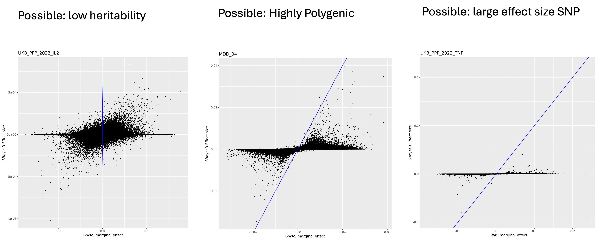
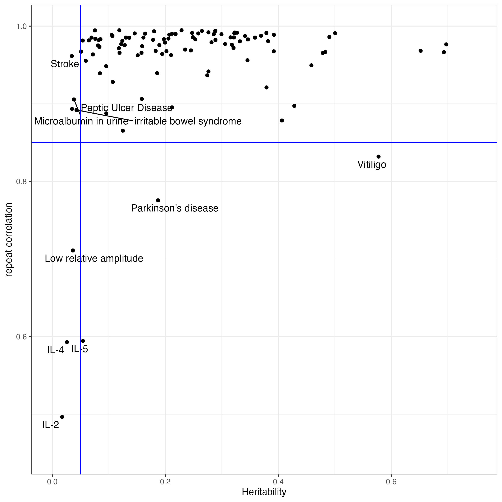

```{r setup, include=FALSE, echo = F, message=F, warning=F}
knitr::opts_chunk$set(echo = TRUE) 
#install.packages('tinytex')
#tinytex::install_tinytex()
library(data.table)
library(ggplot2)
library(dplyr)
```


# Intro


# GWAS summary data 


It has become a standard to share and make publicly available the summary-level data when publishing a GWAS study. However, there is not a unified format of the summay-level data. 
To make a gwas summary data into a proper input file for downstream analysis, such as [SBayesRC](https://cnsgenomics.com/software/gctb/#SBayesRCTutorial) and [COJO](https://yanglab.westlake.edu.cn/software/gcta/#COJO), we need to format it and check the quality. 

This is a summary of formatting, QC and solving missing information of a GWAS sumstat for analysis using SBayesRC. 


```{r, message=F, warning=F, eval = F}
# read in the data
file.name = "PGCALZ2sumstatsExcluding23andMe.txt"
gwas = data.frame(fread(file.name))

```

Start with an empty COJO format table. Column names and order are crucial for a lot of softwares.
We will transfer the corresponding information from raw data to each column in the following sections. 

```{r, message=F, warning=F, eval = F}

# make a new table in stardard format
n.snp = nrow(gwas)
formatted.gwas = data.frame(
  matrix(NA, nrow = n.snp, ncol = 8)
)
colnames(formatted.gwas) = c("SNP", "A1", "A2", "freq", "b", "se", "p", "N")

```


## SNP ID

The commonly used SNP ID is dbSNP IDs, while sometimes there are only physical position of the SNPs and alleles, such as the example data we are using here. 

There are a lot of resources for dbSNP information, such as in [NCBI](https://www.ncbi.nlm.nih.gov/variation/docs/human_variation_vcf/), [Resource bundle from GATK](https://gatk.broadinstitute.org/hc/en-us/articles/360035890811-Resource-bundle), [1000Genome study](https://www.internationalgenome.org/data/) or [Haplotype Reference Consortium](https://ega-archive.org/datasets/EGAD00001002729). 

All the data used in my study which need to refill SNP IDs were from human genome build 37, so we will use a reference data from the same build to infer the IDs.

If the gwas data you are working are is using build 38, make sure you also use a reference data from build 38.

For convenience, I will borrow the snp.info file from eigen-decomposed LD reference to refill the dbSNP IDs. Some of the SNPs in the summary data don't exist in this reference data, so their information can't be refilled in this practice, but it doesn't matter to my further analysis of profiling PRS using the SBayesRC predictors. 

```{r, message=F, warning=F, eval = F}
# read in a reference data for missing information
freq.file="/data/module5/alz/snp.info"
ref.freq = data.frame(fread(freq.file))
head(ref.freq)
```


By matching chromosome, bp position and allelele, we will get the dbSNP ID for the SNPs in our predictor, and put it in the formatted data frame.  
Since the two alleles of a SNP can be regarded as effect allele or reference allele by chance, we will do a bit of trick in the matching by aligning them in character sequence. 

```{r, message=F, warning=F, eval = F}
colname.SNP = "missing"

colname.chr = "chr"
colname.pos = "PosGRCh37"
colname.A1 = "testedAllele"
colname.A2 = "otherAllele"
```


```{r, message=F, warning=F, eval = F}
if(   (colname.SNP != "missing")  ){
  
  formatted.gwas$SNP = gwas[,colname.SNP]
  
}else{
  
  gwas$A = pmin(toupper(gwas[,colname.A1]), toupper(gwas[,colname.A2]))
  gwas$B = pmax(toupper(gwas[,colname.A1]), toupper(gwas[,colname.A2]))
  gwas$chrbpAB = paste0(gwas[,colname.chr], "_", gwas[,colname.pos], "_", gwas$A, "_", gwas$B)
  
  ref.freq$A = with(ref.freq, pmin(A1, A2))
  ref.freq$B = with(ref.freq, pmax(A1, A2))
  ref.freq$chrbpAB = paste0(ref.freq$Chrom, "_", ref.freq$PhysPos, "_", ref.freq$A, "_", ref.freq$B)
  
  gwas$matched_RSID = ref.freq[match(gwas$chrbpAB , ref.freq$chrbpAB), "ID"] 
  gwas[ !(gwas$chrbpAB %in%ref.freq$chrbpAB), "matched_RSID"]  =  gwas[ !(gwas$chrbpAB %in%ref.freq$chrbpAB), "chrbpAB" ]  
  
  formatted.gwas$SNP = gwas$matched_RSID
  
}

head(formatted.gwas[(grep("rs", formatted.gwas$SNP)),])
```

All the target data and reference data we used are from human genome build 37.


## Alleles

Naming of alleles can be various. They could be named as “EffectAllele” vs “NonEffectAllele”, or “A1” vs. “A2”, or “ReferenceAllele” vs. “AlternativeAllele”, etc. We need to make it clear which allele is the effect allele, by reading the README files or online instructions for the data.

In COJO format GWAS file, we always have effect allele in the column A1.

If the alleles are in lower case, make sure you make them uppercase in the formattted data. 


```{r, message=F, warning=F, eval = F}
formatted.gwas$A1= toupper(gwas[,colname.A1])
formatted.gwas$A2 = toupper(gwas[,colname.A2])
```

**Alleles in a SNP must match up to the alleles in LD reference data.** Most softwares do the allele match up for you, but you can also give it a check to make sure the same dbSNP ID in your data have the exactly same two alleles as in the LD reference data. 

If non-effect allele (A2) is missing, refill from reference:

```{r, message=F, warning=F, eval = F}

if(colname.A2 != "missing"){
  
    formatted.gwas$A2 = toupper(gwas[,colname.A2])
  
}else{
    ref.freq$A1A2= paste0(ref.freq$A1, ref.freq$A2)
    gwas$A1A2 = ref.freq[match(gwas[,colname.SNP] , ref.freq$ID),"A1A2"]
    gwas$A1A2 = as.character(gwas$A1A2)
    gwas[,colname.A1] = as.character(gwas[,colname.A1])
    
    # Create new column 'other_allele'
    gwas$other_allele <- mapply(function(a1a2, test_allele) {
      paste0(setdiff(strsplit(a1a2, "")[[1]], test_allele), collapse = "")
    }, gwas$A1A2, gwas[,colname.A1])
    
    formatted.gwas$A2 = gwas$other_allele

}
```

## p value

P value is commonly reported in the summary data. We can just take the column.   
The p value can get very small values, and it is in scientific format. Sometimes some softwares would recognize it as characters. We can use as.numeric to force it as numeric. 

```{r, message=F, warning=F, eval = F}
colname.p = "p"
formatted.gwas$p = as.numeric(gwas[,colname.p])

head(formatted.gwas[(grep("rs", formatted.gwas$SNP)),])
```

If p value column is in -log10 scale, we need convert it back to p, and be careful with the values of “inf”. Although this situation is very rare.


## Sample Size

Sample size is sometimes missing in the summary data, when we will have to find it out from the publication.   

Sometimes disease data would like to include the sample size as two columns, as cases and controls separately. If that's the case, we will add them up, or calculate effective sample size. Be aware that, it's recommended to use the real sample size (case + control) in SBayesRC method. 

If it is NCHROBS (number chromosomes observed) reported in summary data, we will divide the number by 2.   


```{r, message=F, warning=F, eval = F}

colname.N = "N"

sample.size.names=unlist(strsplit(colname.N, ","))

if(length(sample.size.names)==1){
  if(is.na(as.numeric(colname.N) )== T) {
    if(colname.N == "NCHROBS"){
      formatted.gwas$N = 0.5* (gwas[, colname.N])
    }else{
      formatted.gwas$N = gwas[, colname.N]
    }
  }else{
    formatted.gwas$N = as.numeric(colname.N)
  }
}else{
  formatted.gwas$N= gwas[, sample.size.names[1]] + gwas[,sample.size.names[2]]
}

head(formatted.gwas)
```

<br>
<br>

Per SNP sample size can be very different when the data is from a study of meta analysis. We can do a QC by excluding SNPs with too different sample size. Since the distribution is different for each study, it can be arbitrary to give it a cutline of sample size, or a specified number of SD. Another way of QC is to exclude the SNPs with very low number of sample size. At the same time, we don't want to lose too many SNPs.

There is not a standardized way of sample size QC, and the decision also depends on the downstream analysis. By checking the distribution of it, we can get a clue of what to fix when you get a killed job in the next step. 

## Allele Frequency

The two alleles in reference data and in gwas summary data could be swapped. We will firstly calculate the effect allele frequency in the reference data. 

```{r, message=F, warning=F, eval = F}
ref.freq$gwasA1 = formatted.gwas[match(ref.freq$ID, formatted.gwas$SNP),"A1"]
ref.freq$sign = sign(( as.numeric(ref.freq$gwasA1  == ref.freq$A1))-0.5)
ref.freq$gwasA1freq= abs(as.numeric(ref.freq$gwasA1  != ref.freq$A1) - ref.freq$A1Freq)
```

<br>
<br>


Allele frequency is sometimes separately included for cases and controls. If that's the case, we will do a calculation with the number of cases and controls. 

$$
f = \frac{N_{\text{case}} f_{\text{case}} + N_{\text{ctrl}} f_{\text{ctrl}}}{N_{\text{case}} + N_{\text{ctrl}}}
$$
- *f* is the allele frequency.    
- *N* is the sample size


If allele frequency is available, we can compare it to the reference data in a plot, and remove the outliers. 

If allele frequency is missing, we can borrow that information from a reference data. This is what happened in our toy data. 

```{r, message=F, warning=F, eval = F}
colname.freq = "missing"

allele.frequency.names=unlist(strsplit(colname.freq, ","))

if(length(allele.frequency.names) == 2) {
  
  ## Allele frequency is sometimes separately included for cases and controls. 
  freq.case = allele.frequency.names[1]
  freq.control = allele.frequency.names[2]
  N.case = sample.size.names[1]
  N.control = sample.size.names[2]
  
  formatted.gwas$freq = ( (gwas[,freq.case] * gwas[,N.case]) + (gwas[,freq.control] * gwas[,N.control]) ) /(gwas[,N.case] + gwas[,N.control])
  ref.freq$freq.in.gwas = formatted.gwas[match(ref.freq$ID, formatted.gwas$SNP) , "freq"]
  freq.plot = ggplot(data = ref.freq, aes(x = gwasA1freq, y =freq.in.gwas )) + geom_point(size = 0.2) + xlab("AF in reference data") + ylab("AF in GWAS summary statistic")
  ggsave(paste0(file.name, "_AF_plot.png"), freq.plot, height = 8, width = 8)
  
}else{
  
  ## allele frequency is sometimes missing
  if(colname.freq == "missing"){
    formatted.gwas$freq = ref.freq[match( formatted.gwas$SNP, ref.freq$ID),"gwasA1freq"]
    
  }else{
    
    # if freq is available, we will compare it with reference data and make a plot
    formatted.gwas$freq = as.numeric( gwas[,colname.freq] )
    ref.freq$freq.in.gwas = formatted.gwas[match(ref.freq$ID, formatted.gwas$SNP) , "freq"]
    freq.plot = ggplot(data = ref.freq, aes(x = gwasA1freq, y =freq.in.gwas )) + 
      geom_point(size = 0.2) + 
      xlab("AF in reference data") + 
      ylab("AF in GWAS summary statistic")
    ggsave(paste0(file.name, "_AF_plot.png"), freq.plot, height = 8, width = 8)
    
  }
}

head(formatted.gwas[(grep("rs", formatted.gwas$SNP)),])

```


<br>
<br>

Here is an example plot from another data. You can use a difference threshold 0.2 to exclude outlying SNPs.

```{r, out.width = "400px", echo = F, eval = F}
knitr::include_graphics("ADHD_meta_Jan2022_iPSYCH1_iPSYCH2_deCODE_PGC.meta_AF_plot.png")
```

An example code to QC on allele frequency here:

```{r, eval = F}
## example command. Don't run it.
freq.outlier = ref.freq[which(abs(ref.freq$gwasA1freq - ref.freq$freq.in.gwas) > 0.2), "ID"]
```


## Effect Size

Effect size is usually named as "effect" or "b". 
If it's reported as OR, odds ratio, we will do a log transformation. 

If effect size is missing, and only z score is supplied, we will calculate effect size with z score, allele frequency and sample size, assuming phenotypic variance is equal to 1. 


```{r, out.width = "250px", echo = F, eval = F}
knitr::include_graphics("b_formula.png")
```

$$
b = \frac{z}{\sqrt{2 \cdot f \cdot (1 - f) \cdot (N + z^2)}}
$$

where:   
- *z* is the z-score.   
- *f* is the allele frequency.    
- *N* is the sample size.    


```{r, message=F, warning=F, eval = F}

colname.b = "missing" 
colname.z = "z"


if(colname.b == "missing" & colname.z != "missing"){
  formatted.gwas$z = gwas[,colname.z]
  formatted.gwas$b = ( formatted.gwas$z )/( ((2 *(formatted.gwas$freq) * (1 - formatted.gwas$freq) * ( formatted.gwas$N + (formatted.gwas$z)^2)))^0.5 )
}  else if(colname.b == "OR" | colname.b == "odds_ratio"){
  formatted.gwas$b = log(gwas[,colname.b])
}else{
  formatted.gwas$b = gwas[,colname.b]
}

head(formatted.gwas[(grep("rs", formatted.gwas$SNP)),])

```

## Standard error of effect size

If  *se*  is missing, we calculate it from effect size, allele frequency and sample size using the formula, assuming phenotypic variance is equal to 1. 

$$
\text{se} = \frac{1}{\sqrt{2 \cdot f \cdot (1 - f) \cdot (N + z^2)}}
$$

```{r, out.width = "300px", echo = F, eval = F}
knitr::include_graphics("se_formula.png")
```

where:   
- *z* is the z-score.   
- *f* is the allele frequency.    
- *N* is the sample size.    


```{r, message=F, warning=F, eval = F}


colname.se = "missing"

if(colname.se == "missing"){
  
  formatted.gwas$z = sign(formatted.gwas$b) * abs( qnorm(formatted.gwas$p/2) )
  formatted.gwas$se =1/sqrt(2 * formatted.gwas$freq *(1 - formatted.gwas$freq) *(formatted.gwas$N +  (formatted.gwas$z ^ 2)  )  )
  
}else{
  
  formatted.gwas$se = gwas[,colname.se]
  
}

head(formatted.gwas[(grep("rs", formatted.gwas$SNP)),])

```

## output into cojo format 

We can exclude the SNPs with missing information, or outlying sample size and allele frequency, before write it into a COJO file.

We usually use .ma as the extension name for COJO files.


```{r, message=F, warning=F, eval = F}

output = paste0(file.name, ".ma")

formatted.gwas = formatted.gwas[which(is.na(formatted.gwas$freq) == F) ,]

formatted.gwas = formatted.gwas[which(!formatted.gwas$SNP %in% N.outlier.snps) ,]

formatted.gwas = formatted.gwas[,1:8]

write.table(formatted.gwas, file=output, quote = F, sep ="\t", row.names = F)
```

## executable tool 

For automation, use cojo_format.R with column name arguments as demonstrated. We didn’t include QC in this tool since SBayesRC in GCTB has included it.

```{bash, eval = F}

## input data path
input="/data/module5/alz/PGCALZ2sumstatsExcluding23andMe.txt"
info="/data/module5/alz/snp.info"
exedir="/data/module5/alz/"

## output 
output="PGCALZ2sumstatsExcluding23andMe.txt.ma"

## input column names
A1="testedAllele"
A2="otherAllele"
PVAL="p"
Nsize="N"

## these columns are missing, so we declare them as missing.
SNP="missing"
BETA="missing"
SE="missing"
AF="missing"

## these parameters and their flag in the code should be skipped if they are not provided or needed
Z="z"      
chr="chr"
pos="PosGRCh37"

## run the code
Rscript  ${exedir}/cojo_format.R  \
  --file  ${input}  \
  --out  ${output}   \
  --SNP  $SNP   \
  --chr $chr \
  --pos $pos \
  --A1  $A1    \
  --A2   $A2    \
  --freq  $AF   \
  --pvalue  $PVAL  \
  --beta  $BETA  \
  --se  $SE   \
  --z $Z  \
  --samplesize  $Nsize  \
  --ref  ${info}

```


# SBayesRC

The practice is following the [tutorial in GCTB website](https://gctbhub.cloud.edu.au/software/gctb/#SBayesRCTutorial). 

## choose LD matrix 

We don't want to impute more than 30% SNPs in the LD matrix. If the GWAS summary stat has less than 70% of the SNPs in the 7.3M LD reference, we will switch to the HapMap3 LD reference. 

```{bash, eval = F}
## choose LD matrix based on number of SNPs
ldm1=/QRISdata/Q3895/ldm/eigen/ukbEUR_Imputed/
ldm2=/QRISdata/Q3895/ldm/eigen/ukbEUR_HM3/
if [ $(wc -l  ${trait}/${gwas_file}  | awk '{print $1}'  ) -gt  5149563 ]; then   ldm=$ldm1 ; else  ldm=$ldm2; fi
```

## Impute 

This method is based on a low-rank approximation which utilises the eigenvalues and eigenvectors of block-wise LD correlation matrices. It requires SNPs that are included in the LD reference to be also present in the GWAS samples. Thus, we need to impute the GWAS summary statistics for any missing SNPs that are only present in the LD reference. 

```{bash, eval = F}
gctb --ldm-eigen $ldm --gwas-summary ${ma_file}.ma --impute-summary --out ${ma_file} --thread 10
```

## SBayesRC

This command will generate a text file for SNP effect estimates test.snpRes, text files for model parameters test.parRes and test.parSetRes, and a folder that stores the MCMC samples for all model parameters test.mcmcsamples.

```{bash, eval = F}
gctb   \
--sbayes RC  \
--ldm-eigen   ${ldm}   \
--gwas-summary   ${ma_file}.imputed.ma   \
--annot  $annot  \
--out  ${trait}/SBayesRC/GCTB/${gwas_file}_sbrc_gctb   \
--thread 10 
```

## Examine SBayesRC effect size

At last we compare the marginal effect size with the effect size from SBayesRC with a simple plot. 

```{bash, eval = F}
Rscript  effect_size_plot_updated.R    $trait   ${ma_file}.imputed.ma   ${ma_file}_sbrc_gctb.snpRes
```


```{r, eval = F}
args=commandArgs(trailingOnly = TRUE)

trait=args[1]
gwas.file = args[2]
predictor.file=args[3]

library(data.table)
library(ggplot2)

gwas = data.frame(fread(paste0(trait, "/", gwas.file)))
predictor=data.frame(fread(paste0(trait, "/", predictor.file)))


predictor$effect.in.gwas = as.numeric(gwas[match(predictor$Name, gwas$SNP),"b"])
predictor$A1.in.gwas =  gwas[match(predictor$Name, gwas$SNP),"A1"]

predictor$marginal.effect = predictor[,"effect.in.gwas"] *(sign((as.numeric(predictor$A1 == predictor$A1.in.gwas) - 0.5)))

predictor$gwas.se =  gwas[match(predictor$SNP, gwas$SNP),"se"]
predictor$threshold = abs(predictor$effect.in.gwas) + 3*(predictor$gwas.se)
predictor$outlier = (abs(predictor$BETA) > abs(predictor$threshold))

st=format(Sys.time(), "%Y%m%d_%H_%M")

effect.plot = ggplot(data = predictor, aes(x = marginal.effect, y = BETA,  color= outlier)) + geom_point(size = 0.4) +  
  geom_abline(intercept=0, slope=1, color="blue")    +
  labs(title=predictor.file,  x="GWAS marginal effect", y = "SBayesR Effect size") 


ggsave(effect.plot, filename = paste0("Figures/", trait, "_"  , predictor.file ,  "_compare_marginal_effect_vs_SBayesRC_", st, ".png"), height = 8, width = 8)


```

We expect to see most SNPs plotted between the x axis and the diagnol line, indicating the shrinkage of joint effect. Here are a few patterns we see the most. 




# Select traits 

We initially collected XX traits, but some of them have very low heritability, and the prediction accuracy is not good enough for consistency evaluation. 
Starting with a version of 149 traits collected before 2024.10.10, we selected the traits with liability scaled heritability > 0.05.
Since SBayesRC analysis uses sampling methods, the weights of SNPs are not the same when we rerun SBayesRC. We calculated the correlation of PGS between two independent SBayesRC resun, and selected only the traits with rerun correlation > 0.85


```{r, eval = F}
predictors = read.csv("Data/Predictors/Predictor_Release_20241010.csv")
predictors =predictors[which(predictors$unpicked_predictors_for_CEPH_project != "Yes"),]


#merge the liability scaled heritability in the table
hsq = read.csv("Data/Predictors/Prevalence_and_hsq_summary_updated_Oct29.2024.csv", row.names =1)
hsq_extra_cols <- setdiff(names(hsq), names(predictors))
predictors_extended <- predictors %>%
  left_join(hsq[, c("Predictor", hsq_extra_cols)], by = "Predictor")

#select based on rerun correlations
rerun.cor = read.csv("Data/Predictors/correlation_of_reruns_and_hsq.csv")
excluded.traits = rerun.cor[which(rerun.cor$cor_rerun0_rerun1 < 0.85),]
```


From this plot, we can see that, we observed heritability is lower than 0.05, the rerun correlation will turn out low.  


In this project, we made selection based on the liability scaled heritability and rerun correlation. 




```{r, eval = F}
predictors_extended$selected = !(predictors_extended$Predictor %in% excluded.traits$variable | predictors_extended$Life_Risk_based_h2_in_liability_scale < 0.05)
```


```{r, eval = F, echo = F}
#################
##generate SupTable2
################
# The variance captured by each SNP is estimated by SBayesRC. Calculation is in Tab of "MissingSNP".


var.exp = read.csv("Data/Predictors/Variance_captured_in_each_data_test3.csv", row.names = 1)
row.names(var.exp) = var.exp$V1
colnames(var.exp)[1] = "Predictor"
var.exp = var.exp[,-ncol(var.exp)]
var.exp = var.exp[,-ncol(var.exp)]

merged.predictor.info = left_join(predictors_extended, var.exp, by = "Predictor")

## merge in variance captured by SNPs inlifelines data
ll.var = read.csv("Data/Predictors/Variance_captured_in_LL.csv", row.names = 1)

merged.predictor.info$LL.HRC = ll.var[match(merged.predictor.info$Predictor, ll.var$V1), "LL"]
write.csv(merged.predictor.info,"Tables/SupTable2_Predictors_20250610.csv", row.names = F )


## merge in the mean and sd of benchmarking data, lifelines
merged.predictor.info = read.csv("Tables/SupTable2_Predictors_20250623.csv")

ugli1.mean = read.csv("Data/LifeLines_MEAN_and_SD_of_traits_for_standardization.csv", row.names =1)
ugli1.mean$trait = gsub("met.d.", "met-d-", ugli1.mean$trait)

merged.predictor.info$meanPGS_in_BM = ugli1.mean[match(merged.predictor.info$Predictor, ugli1.mean$trait),"mean"]
merged.predictor.info$sdPGS_in_BM = ugli1.mean[match(merged.predictor.info$Predictor, ugli1.mean$trait),"sd"]

write.csv(merged.predictor.info,"Tables/SupTable2_Predictors_20250624.csv", row.names = F )

```
