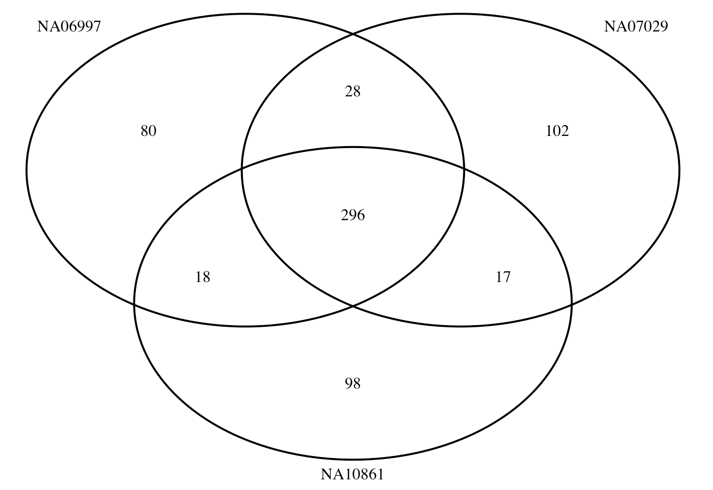

```{r setup, echo=FALSE, message=FALSE, warning=FALSE}
# You need these libraries to run this template:
library(rmarkdown)    # install.packages("rmarkdown") 
library(epuRate)      # devtools::install_github("holtzy/epuRate", force=TRUE)
library(ggplot2)
library(DT)
library(plotly)
library(data.table)
library(gridExtra)
library(grid)
library(ggfortify)
library(reshape2)
library(cowplot)
library(ggpubr)
library(kableExtra)
library(openxlsx)
library(ggrepel)
library(plotROC)
library(pROC)
library(dplyr)
```


# Data resource

High coverage whole genome sequencing data was downloaded from the 1000 Genomes project.

https://www.internationalgenome.org/data-portal/sample

citation: Marta Byrska-Bishop et al., High-coverage whole-genome sequencing of the expanded 1000 Genomes Project cohort including 602 trios   
https://www.cell.com/cell/fulltext/S0092-8674(22)00991-6#sectitle0030


```{bash, eval = F}

## downloaded cram file 
ftp://ftp.sra.ebi.ac.uk/vol1/run/ERR398/ERR3989270/NA07029.final.cram 
ftp://ftp.sra.ebi.ac.uk/vol1/run/ERR398/ERR3989266/NA06997.final.cram
ftp://ftp.sra.ebi.ac.uk/vol1/run/ERR398/ERR3989299/NA10861.final.cram	

## index the files
samtools index -b ${sample}.final.cram

```

The files are alignment files, which were alighed against the human genome build 38. 

# process WGS data

## call variants 

Alignment files are processed to call variants at BP resolution using GATK best practice. 

```{bash, eval = F}

i=$SLURM_ARRAY_TASK_ID
module load bcftools
samples=("NA06997" "NA07029" "NA10861")

for samples in "${samples[@]}"; do
# call variants
Pipelines/gatk-4.1.9.0/gatk HaplotypeCaller  \
-R $ref  \
-I  withBuild38/Alighed_bam/${sample}.final.cram   \
--dbsnp  Pipelines/hg38/dbsnp_146.hg38.vcf.gz  \
--emit-ref-confidence BP_RESOLUTION     \
-O  withBuild38/Called_Variants/ref_confidence_BP_resolution/${sample}_dbSNP_from1KG_chr${i}.vcf.gz     \
-L  chr${i}

## separate multiallelic into rows
bcftools norm -m - withBuild38/Called_Variants/ref_confidence_BP_resolution/${sample}_dbSNP_from1KG_chr${i}.vcf.gz  >  withBuild38/Called_Variants/ref_confidence_BP_resolution/${sample}_dbSNP_biallelic_from1KG_chr${i}.vcf.gz
done
```


## Annotate SNPs

Although we used the annotate option in GATK with *--dbsnp  Pipelines/hg38/dbsnp_146.hg38.vcf.gz*, due to the limit of samples in allele coverage, most of the SNPs are not annotated properly. We will have to annotate them based on the alleles pairs in our predictors. 

```{bash, eval = F}

#https://www.biostars.org/p/9554277/
wget -c ftp://gsapubftp-anonymous@ftp.broadinstitute.org/bundle/hg38/dbsnp_146.hg38.vcf.gz
wget -c ftp://gsapubftp-anonymous@ftp.broadinstitute.org/bundle/hg38/dbsnp_146.hg38.vcf.gz.tbi

grep rs  Pipelines/HRC.r1-1.GRCh37.wgs.mac5.sites.tab  | awk '{print $3}'  > HRC.SNPs.with.dbSNP.IDs.txt

zless  Pipelines/hg38/dbsnp_146.hg38.vcf.gz  | grep -w -f HRC.SNPs.with.dbSNP.IDs.txt  > ../SNP_lists/dbsnp_146.hg38_in_HRCpanel.txt
```


Since we have only one sample in each VCF file, we are going to do annotation by reading it into R.  


```{bash, eval = F}
i=$SLURM_ARRAY_TASK_ID

sample="NA06997"
target=${sample}_dbSNP_biallelic_from1KG_chr${i}

zless  withBuild38/Called_Variants/ref_confidence_BP_resolution/${target}.vcf.gz  > ${target}.vcf
grep "^#" ${target}.vcf  > ${target}.vcf.header
Rscript  annotate_vcf_updated.R  ${sample} ${i}
cat ${target}.vcf.header  ${target}.vcf_annotated.txt  > ${target}_annotated.vcf

```


This is the R script to annotate SNPs.

```{r,eval = F}
## this is annotate_vcf_updated.R
#setwd("/scratch/project_mnt/S0007/uqtlin5/CEPH_samples/WGS")

args=commandArgs(trailingOnly = TRUE)
library(data.table)
sample=args[1]
chr=args[2]

#sample="NA06997"
#chr=22

info.file = "/QRISdata/Q6913/Pipeline/ukb20k_7M_4cM/snp.info"
info = data.frame(fread(info.file))

geno.file =  paste0( sample, "_dbSNP_biallelic_from1KG_chr", chr, ".vcf")
dbsnp.file =  paste0("SNP_lists/", "dbsnp_146.hg38_in_HRC_chr", chr,".txt")

geno = read.table(geno.file)
dbsnp = read.table(dbsnp.file)

geno$chr_pos = paste0(geno$V1, "_", geno$V2)
dbsnp$chr_pos = paste0(dbsnp$V1, "_", dbsnp$V2)

geno$A1.in.dbsnp = dbsnp[match(geno$chr_pos, dbsnp$chr_pos), "V4"]
geno$A2.in.dbsnp = dbsnp[match(geno$chr_pos, dbsnp$chr_pos), "V5"]
geno$rsID = dbsnp[match(geno$chr_pos, dbsnp$chr_pos), "V3"]

geno$A1.in.pred = info[match(geno$rsID, info$ID),"A1"]
geno$A2.in.pred = info[match(geno$rsID, info$ID),"A2"]

## keep useful geno
geno = geno[geno$rsID%in%info$ID,]

## with alt SNPs
geno.group2 = geno[which(geno$V5 != "<NON_REF>"), ]
selected.geno.group2 = geno.group2[( (geno.group2[,"V4"] == geno.group2[, "A1.in.pred"] ) &  
                                       (geno.group2[,"V5"] == geno.group2[, "A2.in.pred"] ))|
                                   ( (geno.group2[,"V4"] == geno.group2[, "A2.in.pred"] ) &  
                                       (geno.group2[,"V5"] == geno.group2[, "A1.in.pred"] ))
                                   ,]

## non alt SNPs
geno.group1 = geno[which(geno$V5 == "<NON_REF>" & geno$V4 ==geno$A1.in.pred ),]
geno.group1 = geno.group1[ !geno.group1$rsID %in% selected.geno.group2$rsID ,]
geno.group1$V5 = geno.group1$A2.in.pred

geno.group3 = geno[which(geno$V5 == "<NON_REF>" & geno$V4 ==geno$A2.in.pred),]
geno.group3 = geno.group3[ !geno.group3$rsID %in% selected.geno.group2$rsID ,]
geno.group3$V5 = geno.group3$A1.in.pred

## merge back
ant.geno = rbind(geno.group1, selected.geno.group2, geno.group3)
sort.geno= ant.geno[order(ant.geno$V2),]

write.table(sort.geno[,c("V1", "V2", "rsID", "V4", "V5", "V6", "V7", "V8", "V9", "V10")], paste0(geno.file, "_annotated.txt" ), quote = F, sep ="\t", row.names = F, col.names = F)

```

Some SNPs in our 7.3M SBayesRC predictors can't be detected in the few WGS data, lacking proper alleles. 

Example of missing SNP:

```{r, eval = F}

 geno[which(geno$rsID== "rs242078"),]
#             V1       V2       V3        V4        V5     V6 V7
# 32897331 chr22 32832706 rs242078 ATAATACTT         A 335.64  .
# 32897332 chr22 32832706 rs242078 ATAATACTT GTAATACTT 335.64  .
# 32897333 chr22 32832706 rs242078 ATAATACTT <NON_REF> 335.64  .
#                                                                                                                              V8
# 32897331   BaseQRankSum=-0.933;DB;DP=36;ExcessHet=3.0103;MLEAC=0;MLEAF=0;MQRankSum=0;RAW_MQandDP=129600,36;ReadPosRankSum=0.166
# 32897332 BaseQRankSum=-0.933;DB;DP=36;ExcessHet=3.0103;MLEAC=1;MLEAF=0.5;MQRankSum=0;RAW_MQandDP=129600,36;ReadPosRankSum=0.166
# 32897333   BaseQRankSum=-0.933;DB;DP=36;ExcessHet=3.0103;MLEAC=0;MLEAF=0;MQRankSum=0;RAW_MQandDP=129600,36;ReadPosRankSum=0.166
#                         V9                                 V10        chr_pos
# 32897331 GT:AD:DP:GQ:PL:SB 0/0:15,0:30:99:343,430,1302:9,6,9,6 chr22_32832706
# 32897332 GT:AD:DP:GQ:PL:SB   0/1:15,13:30:99:343,0,438:9,6,9,6 chr22_32832706
# 32897333 GT:AD:DP:GQ:PL:SB 0/0:15,2:30:99:343,422,1130:9,6,9,6 chr22_32832706
#          A1.in.dbsnp A2.in.dbsnp     rsID A1.in.pred A2.in.pred
# 32897331           A           G rs242078          G          A
# 32897332           A           G rs242078          G          A
# 32897333           A           G rs242078          G          A


```


## merge chromosomes

The annotated chromosomes of each data are merged into one vcf file. 

```{bash , eval = F}

module load vcftools 
samples=("NA06997" "NA07029" "NA10861")
for sample in "${samples[@]}"; do
vcf-concat  ${sample}_dbSNP_biallelic_from1KG_chr1_annotated.vcf \
            ${sample}_dbSNP_biallelic_from1KG_chr2_annotated.vcf \
            ${sample}_dbSNP_biallelic_from1KG_chr3_annotated.vcf \
            ${sample}_dbSNP_biallelic_from1KG_chr4_annotated.vcf \
            ${sample}_dbSNP_biallelic_from1KG_chr5_annotated.vcf \
            ${sample}_dbSNP_biallelic_from1KG_chr6_annotated.vcf \
            ${sample}_dbSNP_biallelic_from1KG_chr7_annotated.vcf \
            ${sample}_dbSNP_biallelic_from1KG_chr8_annotated.vcf \
            ${sample}_dbSNP_biallelic_from1KG_chr9_annotated.vcf \
            ${sample}_dbSNP_biallelic_from1KG_chr10_annotated.vcf \
            ${sample}_dbSNP_biallelic_from1KG_chr11_annotated.vcf \
            ${sample}_dbSNP_biallelic_from1KG_chr12_annotated.vcf \
            ${sample}_dbSNP_biallelic_from1KG_chr13_annotated.vcf \
            ${sample}_dbSNP_biallelic_from1KG_chr14_annotated.vcf \
            ${sample}_dbSNP_biallelic_from1KG_chr15_annotated.vcf \
            ${sample}_dbSNP_biallelic_from1KG_chr16_annotated.vcf \
            ${sample}_dbSNP_biallelic_from1KG_chr17_annotated.vcf \
            ${sample}_dbSNP_biallelic_from1KG_chr18_annotated.vcf \
            ${sample}_dbSNP_biallelic_from1KG_chr19_annotated.vcf \
            ${sample}_dbSNP_biallelic_from1KG_chr20_annotated.vcf \
            ${sample}_dbSNP_biallelic_from1KG_chr21_annotated.vcf \
            ${sample}_dbSNP_biallelic_from1KG_chr22_annotated.vcf \
             > ${sample}_combined_SBRC_SNPs.vcf
done

```

# profile PRS

We profiled PRS from the annotated VCF files with all the SBayesRC predictors. 

```{bash, eval = F}
i=$SLURM_ARRAY_TASK_ID
traitfile="/QRISdata/Q6913/GCTB_predictor_list_for_batch_profiling.txt"
trait=$(sed "${i}q;d" $traitfile | awk '{print $1}' )
predictor=$(sed  "${i}q;d"  $traitfile  | awk '{print $3}' )
outdir=PRS_all_GCTB
mkdir -p $outdir
samples=("NA06997" "NA07029" "NA10861")
for sample in "${samples[@]}"; do
  cohort=${sample}_WGS
  input=${sample}_combined_SBRC_SNPs.vcf
  plink \
   --vcf  $input \
   --double-id  \
   --score  $predictor  2 5 8  header sum    \
   --out ${outdir}/${cohort}_${trait}_SBayesRC
done
```

The PGS were merged together for each sample.  

```{bash , eval = F}

outdir=PRS_all_GCTB
samples=("NA06997" "NA07029" "NA10861")

for sample in "${samples[@]}"; do
  grep ${sample}  ${outdir}/*profile | \
  sed "s/${outdir}\/${sample}_WGS_//" | \
  sed 's/_SBayesRC.profile://'  | \
  awk '{print $1, $5, $6, $7}'  \
  > ${sample}_WGS_PRS_vGCTB.txt
done

```

Then the three files are merged into one. 

```{r, eval = F}

wgs.sample.list = c("NA07029" , "NA06997", "NA10861")
merged.wgs.prs = data.frame()
for (i in 1:length(wgs.sample.list)){
  sample.id = wgs.sample.list[i]
  wgs.prs= read.table(paste0("Data/WGS/", sample.id , "_WGS_PRS_vGCTB.txt"))
  colnames(wgs.prs) = c("Trait"  , paste0(sample.id, c("_CNT", "_CNT2", ""  ) ) )
 if (nrow(merged.wgs.prs) == 0) {  # Initialize merged.wgs.prs with the first file's data
    merged.wgs.prs = wgs.prs
  } else {
    merged.wgs.prs = merge(merged.wgs.prs, wgs.prs, by = "Trait", all = TRUE)
  }
}
row.names(merged.wgs.prs) = merged.wgs.prs$Trait
merged.wgs.prs = merged.wgs.prs[,-1]
write.csv(merged.wgs.prs, file = "Data/WGS/WGS_merged_GCTB_PRS.csv")

```


# SNP coverage

When we profile PGS using plink, the SNPs in predictors but not target genotype data will be put into a nopred file. We checked these SNPs across the three samples.

```{r, eval = F}
library(VennDiagram)
a = read.table("Data/nopred/NA06997_WGS_ADHD_01_SBayesRC.nopred")
b = read.table("Data/nopred/NA07029_WGS_ADHD_01_SBayesRC.nopred")
c = read.table("Data/nopred/NA10861_WGS_ADHD_01_SBayesRC.nopred")

# Create a Venn diagram
venn.plot <- venn.diagram(
  x = list(
    Vector1 = a$V2,
    Vector2 = b$V2,
    Vector3 = c$V2
  ),
  category.names = c("NA06997", "NA07029", "NA10861"),
  filename = NULL,  # Use NULL to display the diagram in RStudio
  output = TRUE
)

grid.newpage()
grid.draw(venn.plot)
```


