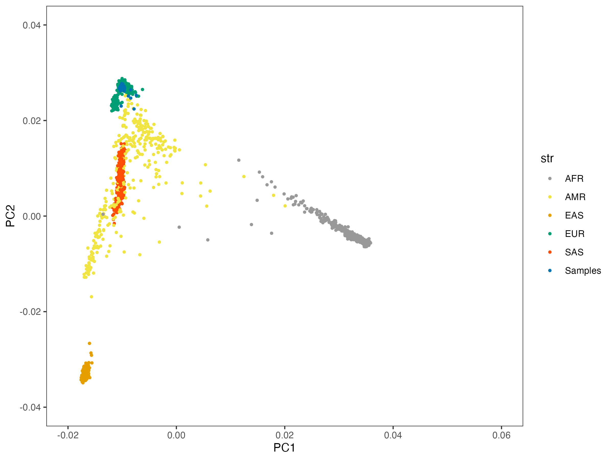

```{r setup, echo=FALSE, message=FALSE, warning=FALSE}
# You need these libraries to run this template:
library(rmarkdown)    # install.packages("rmarkdown") 
library(epuRate)      # devtools::install_github("holtzy/epuRate", force=TRUE)
library(ggplot2)
library(DT)
library(plotly)
library(data.table)
library(gridExtra)
library(grid)
library(ggfortify)
library(reshape2)
library(cowplot)
library(ggpubr)
library(kableExtra)
library(openxlsx)
library(plotROC)
library(pROC)
library(dplyr)
library(tidyr)
library(stringr)
```

# Introduction

As a trial for the validity of lcWGS, 48 samples previously genotyped with Illumina GSAv2+MD were submitted for lcWGS including NA06997. Library preparation was conducted in house at the UQ Human Studies Unit and submitted for sequencing in UQ sequencing facility. The 48 samples were pooled with multiplexing, and sequenced in one lane, setting paired end 150bp reads on a SP flowcell using NovaSeq Illumina. Raw data were transferred to us in FastQ format.
All samples passed FastQC quality threshold, and the reads were mapped to human genome assembly build 37 using the bwa in GATK. The GATK best practice pipeline was applied, (sort using sambamba, mark-dup using GATK, Base Quality Score Recalibration using GATK).  Missing SNPs in data were imputed using GLIMPSE25 against the downloaded HRCr1.1 imputation panel. 
GLIPMSE2 uses the reference data to decide the chunks required to speed up imputation in parallel jobs. It connects the imputed chunks into one data per sample in VCF format. The SNP list in imputed data is the same as in the HRC imputation panel.

Related reading:

https://www.genewiz.com/Public/Services/Next-Generation-Sequencing/Low-Pass-WholeGenomeSequencing/

https://pubmed.ncbi.nlm.nih.gov/33770507/


# Alignment

The first step to process low pass sequencing data is the same as whole genome sequencing data. We used FastQC to check the quality and they all passed. Then we aligned them to the human genome build 19 using the best practice in GATK pipeline. 

## tools and references

```{r, engine='sh', eval = F}
## BWA
## http://bio-bwa.sourceforge.net
## Li H. and Durbin R. (2010) Fast and accurate long-read alignment with Burrows-Wheeler Transform. Bioinformatics, Epub. [PMID: 20080505]

# bwa-0.7.17.tar.bz2 is downloaded from 
#https://sourceforge.net/projects/bio-bwa/
tar -xf   bwa-0.7.17.tar.bz2 
cd bwa-0.7.17
make
cp bwa ~/bin/
##Version: 0.7.17-r1188

## sambamba

https://github.com/biod/sambamba/releases
wget https://github.com/biod/sambamba/releases/download/v0.8.2/sambamba-0.8.2-linux-amd64-static.gz
gunzip sambamba-0.8.2-linux-amd64-static.gz 
chmod u+x sambamba-0.8.2-linux-amd64-static 

## Picard
https://github.com/broadinstitute/picard/releases/tag/2.27.4
# click on picard.jar

##GATK
wget https://github.com/broadinstitute/gatk/releases/download/4.2.6.1/gatk-4.2.6.1.zip
unzip gatk-4.2.6.1.zip 

## bundle_source
## use Finder --> go to server
ftp://gsapubftp-anonymous@ftp.broadinstitute.org/bundle/
## hg19

```

## align the reads


```{r align, engine='sh', eval = F}

i=$TASK_ID
WD=/scratch/60days/uqtlin5/X1WGS
ref=${WD}/Pipeline/ucsc.hg19.fasta
samplesheet=${WD}/samplesheet.txt
ncpus=10
cd $WD
sID=$( awk '{print $1}'   $samplesheet | head -n  $i   | tail -n 1 ) 
filename1=$( awk '{print $2}'   $samplesheet | head -n  $i   | tail -n 1 ) 
filename2=$( awk '{print $3}'   $samplesheet | head -n  $i   | tail -n 1 ) 

module load samtools
## index the reference 
## bwa index   Pipeline/ucsc.hg19.fasta

## run alignment
bwa mem -M -t $ncpus $ref  Raw_Data/$filename1  Raw_Data/$filename2 -R "@RG\tID:${sID}\tPL:ILLUMINA\tSM:${sID}" | samtools view -bS  >  TMPDIR/${bamPrefix}.tmp.bam 
## run sort bam
sambamba sort -t $ncpus  -m 200G  -o  TMPDIR/${sID}.sort.bam   TMPDIR/${sID}.tmp.bam  
rm TMPDIR/${sID}.tmp.bam
## mark duplicates
java -jar picard.jar  MarkDuplicates   I=TMPDIR/${sID}.sort.bam    O=TMPDIR/${sID}.markdup.bam   M=TMPDIR/${sID}.dupStat  
```

## recalibration

```{r recalibrate base score, engine='sh', eval = F}

i=$TASK_ID
WD=/scratch/60days/uqtlin5/X1WGS
cd $WD
samplesheet=${WD}/samplesheet.txt
sID=$( awk '{print $1}'   $samplesheet | head -n  $i   | tail -n 1 ) 
sortedNoDup=${WD}/TMPDIR/${sID}.markdup.bam
outDir=${WD}/TMPDIR/
ref=${WD}/Pipeline/hg19/ucsc.hg19.fasta

knownsite1=dbsnp_138.hg19
knownsite2=1000G_omni2.5.hg19.sites
knownsite3=1000G_phase1.indels.hg19.sites
knownsite4=1000G_phase1.snps.high_confidence.hg19.sites
knownsite5=CEUTrio.HiSeq.WGS.b37.bestPractices.hg19
knownsite6=dbsnp_138.hg19.excluding_sites_after_129
knownsite7=hapmap_3.3_hg19_pop_stratified_af
knownsite8=hapmap_3.3.hg19.sites
knownsite9=Mills_and_1000G_gold_standard.indels.hg19.sites
knownsite10=NA12878.HiSeq.WGS.bwa.cleaned.raw.subset.hg19.sites
knownsite11=NA12878.HiSeq.WGS.bwa.cleaned.raw.subset.hg19
knownsite12=NA12878.knowledgebase.snapshot.20131119.hg19

## get the recal table

${WD}/Pipeline/gatk-4.1.9.0/gatk BaseRecalibrator \
   -I  $sortedNoDup  \
   -R $ref \
   --known-sites hg19/${knownsite1}.vcf.gz \
   --known-sites hg19/${knownsite2}.vcf.gz \
   --known-sites hg19/${knownsite3}.vcf.gz \
   --known-sites hg19/${knownsite4}.vcf.gz \
   --known-sites hg19/${knownsite5}.vcf.gz \
   --known-sites hg19/${knownsite6}.vcf.gz \
   --known-sites hg19/${knownsite7}.vcf.gz \
   --known-sites hg19/${knownsite8}.vcf.gz \
   --known-sites hg19/${knownsite9}.vcf.gz \
   --known-sites hg19/${knownsite1}.vcf.gz \
   --known-sites hg19/${knownsite11}.vcf.gz \
   --known-sites hg19/${knownsite12}.vcf.gz \
   --showHidden   \
   -O  ${outDir}/${sID}_recal_data.table_1_12
 
## run recal 
gatk-4.1.9.0/gatk  ApplyBQSR \
   -R $ref  \
   -I $sortedNoDup \
   --bqsr-recal-file  ${outDir}/${sID}_recal_data.table_1_12   \
   -O  ${outDir}/${sID}_recal_1_12.bam
 
## plot recal
gatk-4.1.9.0/gatk   AnalyzeCovariates \
     -bqsr    ${outDir}/${sID}_recal_data.table_1_12    \
     -plots   ${outDir}/${sID}_recal_AnalyzeCovariates_1_12.pdf
```

# use GLYMPSE2 to impute data

GLYMPSE2 is a new tool that takes the alignment files as input and impute against a reference genome. GLYMPSE2 could take in haplotype information. It's much better than loimpute, which impute using the called variants from alignment. 

## use reference data to make chunk files

```{bash, eval = F}

chr=$SLURM_ARRAY_TASK_ID
cd /scratch/project/genetic_data_analysis/uqtlin5/Low_pass_sequencing
module load bcftools
mapfile=1000GP_Phase3/genetic_map_chr${chr}_combined_b37.txt
## HRC version
reffile=HRC.r1-1.EGA.GRCh37.chr${chr}.haplotypes.vcf.gz 

bcftools annotate --rename-chrs chr_name_conv.txt  /QRISdata/Q3046/Reference/HRC//$reffile     | bgzip > chr_renamed_HRC_haplotype_vcf/${reffile}
tabix -p vcf chr_renamed_HRC_haplotype_vcf/${reffile}

./GLIMPSE2/GLIMPSE2_chunk_static  --input  chr_renamed_HRC_haplotype_vcf/$reffile \
--sequential  \
--region chr${chr}  \
--output chunks_HRC.chr${chr}.txt \
--map $mapfile


```


## chunk the reference data

First we generate a chunk file merging from 22 chromosomes.

```{bash, eval = F}
for ((i = 1; i <= 22; i++)); do
  cat chunks_HRC.chr${i}.txt >> chunks_HRC.txt
done
```

Then we will generate a chunked reference data based on each row of this chunk file. 

```{bash, eval = F}
## for each chromosome we will run 

LINE=$SLURM_ARRAY_TASK_ID

cd /scratch/project/genetic_data_analysis/uqtlin5/Low_pass_sequencing
sample=NA06997_COR_S29
refdata=HRC
BAM=${sample}_recal_1_12.bam
chunkfile=chunks_${refdata}_chr1.txt
OUTDIR=GLIMPSE2_imputed_with_${refdata}
mkdir -p $OUTDIR
OUT=${OUTDIR}/${sample}_imputed
CHR=$(sed "${LINE}q;d" $chunkfile | awk '{print $2}' )
IRG=$(sed "${LINE}q;d" $chunkfile | awk '{print $3}' )
ORG=$(sed "${LINE}q;d" $chunkfile | awk '{print $4}' )
REGS=$(echo ${IRG} | cut -d":" -f 2 | cut -d"-" -f1)
REGE=$(echo ${IRG} | cut -d":" -f 2 | cut -d"-" -f2)

mapfile=1000GP_Phase3/genetic_map_${CHR}_combined_b37.txt

./GLIMPSE2/GLIMPSE2_split_reference_static \
  --reference  chr_renamed_${refdata}_haplotype_vcf/HRC.r1-1.EGA.GRCh37.${CHR}.haplotypes.vcf.gz \
  --map ${mapfile} \
  --input-region ${IRG} \
  --output-region ${ORG}  \
  --output  Splitted_${refdata}_panel/${refdata}

```


## pipeline the imputation for all samples

The data will be imputed into chunks using each chunked reference data.

```{bash, eval = F}
## the whole genome has 771 chunks. 

LINE=$SLURM_ARRAY_TASK_ID

cd /scratch/project/genetic_data_analysis/uqtlin5/Low_pass_sequencing

refdata=HRC
OUTDIR=GLIMPSE2_imputed_with_${refdata}
chunkfile=chunks_${refdata}.txt
  
CHR=$(sed "${LINE}q;d" $chunkfile | awk '{print $2}' )
IRG=$(sed "${LINE}q;d" $chunkfile | awk '{print $3}' )
ORG=$(sed "${LINE}q;d" $chunkfile | awk '{print $4}' )
REGS=$(echo ${IRG} | cut -d":" -f 2 | cut -d"-" -f1)
REGE=$(echo ${IRG} | cut -d":" -f 2 | cut -d"-" -f2)

while IFS= read -r BAM; do

  ./GLIMPSE2/GLIMPSE2_phase_static \
  --bam-file  BQRS/${BAM}_recal_1_12.bam \
  --reference Splitted_${refdata}_panel/${refdata}_${CHR}_${REGS}_${REGE}.bin \
  --output ${OUTDIR}/${BAM}_imputed_${CHR}_${REGS}_${REGE}.bcf

done < bam_file_list.txt

```


## ligate the imputed chunks

The imputed chunks are then concatenated together into a bcf file for each sample. 

```{bash, eval = F}

# ligate

while IFS= read -r BAM; do

LST=GLIMPSE2_HRC_ligate/${BAM}_list.txt
ls -1v GLIMPSE2_imputed_with_HRC/${BAM}_imputed_*.bcf > ${LST}
OUT=GLIMPSE2_HRC_ligate/${BAM}_ligated.bcf

job_name="ligate_"${BAM}  
ligatesub=`qsubshcom "  ./GLIMPSE2/GLIMPSE2_ligate_static --input ${LST} --output $OUT " 1 150G $job_name 24:00:00 "  "   `

done < bam_file_list.txt

```

## reformat the data

For the next step, files are converted from bcf format to vcf format

```{bash, eval = F}
## convert bcf to vcf
while IFS= read -r BAM; do
 bcftools convert -O v -o GLIMPSE2_HRC_ligate/${BAM}_ligated.vcf   GLIMPSE2_HRC_ligate/${BAM}_ligated.bcf
done < bam_file_list.txt
```


## extract SNPs 

To reduce the computation burdon, I extracted the 7.3M SNPs from the data. 


```{bash, eval = F}

## convert bcf to vcf
while IFS= read -r BAM; do

grep "^#" GLIMPSE2_HRC_ligate/${BAM}_ligated.vcf > ${BAM}_ligated_dbSNP.vcf 
grep -v "^#"  GLIMPSE2_HRC_ligate/${BAM}_ligated.vcf | grep -w -f SNPs_in_7.4M.txt >> ${BAM}_ligated_dbSNP.vcf 

done < bam_file_list.txt
```

Data of all the samples are merged into one file. 

```{bash, eval = F}
## merge all samples
## did in both folder GLIMPSE2_HRC_ligate_vcf and dbSNP_of_GLIMPSE2_imputed_with_HRC

for file in *.vcf; do
    bgzip -c "$file" > "${file}.gz"
    bcftools index "${file}.gz"

done

qsubshcom " bcftools merge -o LPS_all48samples.vcf.gz -O v -@ 4  *.vcf.gz "  4 150G "merge" 56:00:00 " "   
bcftools merge -o LPS_all48samples.vcf.gz -O v   *.vcf.gz

```


# Profile PRS

PRS are profiled from the merged vcf file directly. 

```{bash, eval = F}
i=$SLURM_ARRAY_TASK_ID
cd /scratch/project/genetic_data_analysis/uqtlin5/Low_pass_sequencing

traitfile="GCTB_SBayesRC_predictors.txt"
trait=$(sed "${i}q;d" $traitfile | awk '{print $1}' )
predictor=$(sed "${i}q;d" $traitfile | awk '{print $2}' )
outdir=PRS_all_GCTB
input=dbSNP_of_GLIMPSE2_imputed_with_HRC/LPS_dbSNP_set.vcf.gz
cohort="LPS"

mkdir -p $outdir

plink \
   --vcf  $input \
   --const-fid  \
   --score  $predictor    2 5 8 header sum   \
   --out ${outdir}/${cohort}_${trait}_SBayesRC


```


# get corresponding samples from chip data

46 out of the 47 samples in this pilot study were genotyped using GSA chip in HSU lab. Here we profiled PGS from the imputed chip data. 

The data were processed in the same way as other HSU data.

```{bash, eval = F}
traitfile="../GCTB_SBayesRC_predictors.txt"
trait=$(sed "${i}q;d" $traitfile | awk '{print $1}' )
predictor=$(sed  "${i}q;d"  $traitfile  | awk '{print $2}' )
outdir=PRS_all_GCTB
mkdir -p $outdir
cohort=MND_B3
input=MND_B3_GSA_imputed_fixed

plink \
   --bfile  $input \
   --score  $predictor  2 5 8  header sum    \
   --out ${outdir}/${cohort}_${trait}_SBayesRC

```


# Compare PGS between lcWGS vs. GSA chip

There are 48 samples in the LPS pilot set. 

1 of them is a ceph control

46 of them are also available in the MND B3 GSA data set

The other 1 is available in ALS_AUS old data. (3728601, or MND_CON_252)


## ancestry of ALS samples 

Here is the 46 overlap samples with PC projected to 1000g. They are all from Europeans.

```{r, eval = F, echo = F}
eur = read.table("Data/LowPass/MND_EUR_samples_IID.txt")

(lps.prs[!(row.names(lps.prs) %in% eur$V1 ) , 1:10])

# check pc

library(ggplot2)
library(ggpubr)

ref = read.table("Data/LowPass/1000G_phase3_20130502_combined_snpsonly.05.common_pca2.eigenvec")
str = read.table("Data/1000GP_Phase3.sample", header = T)
pc = read.table("Data/LowPass/MND_B3_BCC_GSA_updated_cleaned_fixed_norep_famupdated.05.common_pca2.proj.eigenvec")

pc  = pc[which(pc$V2 %in% row.names(lps.prs) ),]

## pc[which(pc$V2 == "3728601" ),] 


colnames(ref) = c("FID", "IID", "PC1", "PC2")
colnames(pc) = c("FID", "IID", "PC1", "PC2")

ref$str = str[match(ref$IID, str$ID),"GROUP"]
pc$str <- "Samples"

pc$str = as.character(pc$str)
pc$FID = as.character(pc$FID)
pc$IID = as.character(pc$IID)
ref$str = as.character(ref$str)
ref$FID = as.character(ref$FID)
ref$IID = as.character(ref$IID)

data = rbind((ref), (pc))


data$str = factor(data$str, levels = c("AFR", "AMR", "EAS", "EUR", "SAS",  "Samples"))

cbPalette <- c("#999999",    
				"#F0E442", 	
				"#E69F00",   
				"#009E73",  
				"#FC4E07", 
				"#0072B2"
				)	

ggplot(data=data, aes(x=PC1, y=PC2, color=str)) + 
  geom_point(size=0.8)  + 
  scale_color_manual(values=cbPalette) +
  ylim(-0.04, 0.04) +
  xlim(-0.02, 0.06) +
  theme_bw() + 
  theme(panel.grid.major.x = element_blank(),
        panel.grid.minor.x = element_blank(),
	panel.grid.major.y = element_blank(),
        panel.grid.minor.y = element_blank())

ggsave("Figures/Ancestry_of_samples_in_LPS&GSAv2.png", width = 8, height = 6)

```




## correlation

### standardize the two data

```{r}

library(reshape2)

standardization.data = read.csv("Data/LifeLines_MEAN_and_SD_of_traits_for_standardization.csv")

## input PRS from low pass
lps.prs = read.csv("Data/LowPass/LPS_all_141_traits_GCTB_PRS.csv")
colnames(lps.prs)[1] = "FID"
lps.prs$IID <- sub("_.*", "", lps.prs$FID)
row.names(lps.prs) = lps.prs$IID
lps.prs = lps.prs[,-c(1:2)]

lps.prs = lps.prs[,colnames(lps.prs) %in%standardization.data$trait ]
standardization.data= standardization.data[  match( colnames(lps.prs) , standardization.data$trait),]

lps.prs.norm = sweep(
  sweep (  lps.prs,  
          2, standardization.data$mean),  
  2, standardization.data$sd, FUN = '/')

lps.prs.norm$IID <- row.names(lps.prs.norm)
melted.lps.prs.norm = reshape2::melt(lps.prs.norm, id.vars = "IID" ) 
melted.lps.prs.norm$value = as.numeric(melted.lps.prs.norm$value)
```

```{r}
## input inhouse imputed GSA data
mnd.b3.bcc = read.csv("Data/LowPass/MND_B3_BCC_GSA_all_141_traits_GCTB_PRS.csv", row.names = 1)

mnd.b3.bcc <- mnd.b3.bcc %>%
  separate(IID, into = c("part1", "part2", "part3", "part4"), sep = "_", fill = "right") %>%
  mutate(
    V1 = part2,                 # Combine part1 and part2 for V1
    IID = if_else(is.na(part4), part3, paste(part3, part4, sep = "_")) # Combine remaining parts for Study_ID
  ) %>%
  select(V1,IID, everything(),-part1, -part2, -part3, -part4, -V3, -V4, -V5, -V6)

row.names(mnd.b3.bcc) = mnd.b3.bcc$IID
mnd.b3.bcc = mnd.b3.bcc[,-c(1:2)]
mnd.b3.bcc = mnd.b3.bcc[,colnames(mnd.b3.bcc) %in%standardization.data$trait ]
standardization.data= standardization.data[  match( colnames(mnd.b3.bcc) , standardization.data$trait),]

mnd.b3.bcc.norm = sweep(
  sweep (  mnd.b3.bcc,  
          2, standardization.data$mean),  
  2, standardization.data$sd, FUN = '/')

mnd.b3.bcc.norm$IID <- row.names(mnd.b3.bcc.norm)
melted.mnd.b3.bcc.norm = reshape2::melt(mnd.b3.bcc.norm, id.vars = "IID" )
melted.mnd.b3.bcc.norm$value = as.numeric(melted.mnd.b3.bcc.norm$value)

```

### select traits

```{r}
predictor.list = read.csv("Tables/SupTable2_Predictors.csv")
included_traits = predictor.list$Predictor
## grouping traits
traits_binary = predictor.list[which(predictor.list$QorB == "Binary" ),"Predictor"]
traits_quanti = predictor.list[which(predictor.list$Location == "Uno_Traits/Quantitative_Traits/"),"Predictor"]
traits_35bm   = predictor.list[which(predictor.list$Location == "Lot_Traits/UKB_35BM_2021/"),"Predictor"]
traits_ppp   = predictor.list[which(predictor.list$Location == "Lot_Traits/UKB_PPP_2022/"),"Predictor"]
traits_fa   = predictor.list[which(predictor.list$Location == "Lot_Traits/UKB_Fatty_Acids/"),"Predictor"]

## select data
melted.mnd.b3.bcc.norm = melted.mnd.b3.bcc.norm[melted.mnd.b3.bcc.norm$variable %in% included_traits,]
melted.lps.prs.norm = melted.lps.prs.norm[melted.lps.prs.norm$variable %in% included_traits,]
```

### merge the two data

```{r}

colnames(melted.mnd.b3.bcc.norm)[3] = "GSAv2"
colnames(melted.lps.prs.norm)[3] = "LPS"

melted.both =  merge(melted.lps.prs.norm, 
                     melted.mnd.b3.bcc.norm[, c("IID", "variable", "GSAv2")], 
                by = c("IID", "variable"), 
                all.x = TRUE)

melted.both$LPS = as.numeric(melted.both$LPS)
melted.both$GSAv2 = as.numeric(melted.both$GSAv2)
melted.both$Trait = predictor.list[match(melted.both$variable, predictor.list$Predictor),"Label"]
melted.SALSA = na.omit(melted.both)
```


### compare across traits


```{r}
result <- melted.SALSA %>%
  group_by(variable) %>%
  summarise(correlation = cor(LPS, GSAv2, use = "complete.obs"), .groups = "drop")
result = data.frame(result)
result$Trait = predictor.list[match(result$variable, predictor.list$Predictor),"Label"]
result$cor = paste0("cor=", round(result$correlation, 2) )
result %>% filter(correlation < 0.95) %>% arrange((correlation))
```


```{r}
hist(result$correlation)
```


mean is `r mean(result$correlation)`

SD is `r sd(result$correlation)`


### across samples


```{r}
result.c.samples <- melted.SALSA %>%
  group_by(IID) %>%
  summarise(correlation = cor(LPS, GSAv2))
summary(result.c.samples$correlation)

hist(result.c.samples$correlation)
```


## plot

### binary

```{r, fig.height=13, fig.width=12}

nbm.plot = ggplot(data = melted.both[ melted.both$variable %in% traits_binary,], aes(x = GSAv2, y = LPS)) +
  facet_wrap(~Trait,  ncol= 6, labeller = labeller(Trait = function(x) str_wrap(x, width = 20))) + 
  geom_abline(intercept = 0, slope = 1, color = "lightblue") +
  geom_point(size = 0.8) + 
  xlim(-3,3) + ylim(-3,3) + 
    theme_classic(base_size = 12) +
theme(
   panel.grid.major = element_blank(), # Remove major grid lines
    panel.grid.minor = element_blank(), # Remove minor grid lines
    plot.title = element_text(hjust = 0.5),
    axis.title = element_text(),
    axis.text = element_text(size = 12),
    strip.background = element_blank()
  ) +
  geom_text(data = result[result$variable %in% traits_binary,],aes(x = -1.5, y = 2, label = cor) )
nbm.plot

#ggsave(plot = nbm.plot,filename =  "Figures/SupFig2_lcWGS_vs_GSAvs_binary_traits.jpeg" , width = 12, height = 13)

```

### quantitative

```{r, fig.height=12, fig.width=12}

nbm.plot = ggplot(data = melted.both[ melted.both$variable %in% traits_quanti,], aes(x = GSAv2, y = LPS)) +
  facet_wrap(~Trait,  ncol= 6, labeller = labeller(Trait = function(x) str_wrap(x, width = 20))) + 
  geom_abline(intercept = 0, slope = 1, color = "lightblue") +
  geom_point(size = 0.8) + 
  xlim(-3,3) + ylim(-3,3) + 
    theme_classic(base_size = 12) +
theme(
   panel.grid.major = element_blank(), # Remove major grid lines
    panel.grid.minor = element_blank(), # Remove minor grid lines
    plot.title = element_text(hjust = 0.5),
    axis.title = element_text(),
    axis.text = element_text(size = 12),
    strip.background = element_blank()
  ) +
  geom_text(data = result[result$variable %in% traits_quanti,],aes(x = -1.5, y = 2, label = cor) )
nbm.plot

#ggsave(plot = nbm.plot,filename =  "Figures/SupFig2_lcWGS_vs_GSAvs_quantitative_traits.jpeg" , width = 12, height = 9)

```

### Biomarker

```{r, fig.height=13, fig.width=12}

nbm.plot = ggplot(data = melted.both[ melted.both$variable %in% traits_35bm,], aes(x = GSAv2, y = LPS)) +
  facet_wrap(~Trait,  ncol= 6, labeller = labeller(Trait = function(x) str_wrap(x, width = 20))) + 
  geom_abline(intercept = 0, slope = 1, color = "lightblue") +
  geom_point(size = 0.8) + 
  xlim(-3,3) + ylim(-3,3) + 
    theme_classic(base_size = 12) +
theme(
   panel.grid.major = element_blank(), # Remove major grid lines
    panel.grid.minor = element_blank(), # Remove minor grid lines
    plot.title = element_text(hjust = 0.5),
    axis.title = element_text(),
    axis.text = element_text(size = 12),
    strip.background = element_blank()
  ) +
  geom_text(data = result[result$variable %in% traits_35bm,],aes(x = -1.5, y = 2, label = cor) )
nbm.plot

#ggsave(plot = nbm.plot,filename =  "Figures/SupFig2_lcWGS_vs_GSAvs_35BM.jpeg" , width = 12, height = 13)

```


### fatty acid

```{r, fig.height=6, fig.width=12}

nbm.plot = ggplot(data = melted.both[ melted.both$variable %in% traits_fa,], aes(x = GSAv2, y = LPS)) +
  facet_wrap(~Trait,  ncol= 6, labeller = labeller(Trait = function(x) str_wrap(x, width = 20))) + 
  geom_abline(intercept = 0, slope = 1, color = "lightblue") +
  geom_point(size = 0.8) + 
  xlim(-3,3) + ylim(-3,3) + 
    theme_classic(base_size = 12) +
theme(
   panel.grid.major = element_blank(), # Remove major grid lines
    panel.grid.minor = element_blank(), # Remove minor grid lines
    plot.title = element_text(hjust = 0.5),
    axis.title = element_text(),
    axis.text = element_text(size = 12),
    strip.background = element_blank()
  ) +
  geom_text(data = result[result$variable %in% traits_fa,],aes(x = -1.5, y = 2, label = cor) )
nbm.plot

#ggsave(plot = nbm.plot,filename =  "Figures/SupFig2_lcWGS_vs_GSAvs_FattyAcid_traits.jpeg" , width = 12, height = 6.5)

```


### PPP

```{r, fig.height=6, fig.width=12}

nbm.plot = ggplot(data = melted.both[ melted.both$variable %in% traits_ppp,], aes(x = GSAv2, y = LPS)) +
  facet_wrap(~Trait,  ncol= 6, labeller = labeller(Trait = function(x) str_wrap(x, width = 20))) + 
  geom_abline(intercept = 0, slope = 1, color = "lightblue") +
  geom_point(size = 0.8) + 
  xlim(-3,3) + ylim(-3,3) + 
    theme_classic(base_size = 12) +
theme(
   panel.grid.major = element_blank(), # Remove major grid lines
    panel.grid.minor = element_blank(), # Remove minor grid lines
    plot.title = element_text(hjust = 0.5),
    axis.title = element_text(),
    axis.text = element_text(size = 12),
    strip.background = element_blank()
  ) +
  geom_text(data = result[result$variable %in% traits_ppp,],aes(x = -1.5, y = 2, label = cor) )
nbm.plot

#ggsave(plot = nbm.plot,filename =  "Figures/SupFig2_lcWGS_vs_GSAvs_PPP.jpeg" , width = 12, height = 4.5)

```


### per person plot


```{r, fig.height=16, fig.width=12}


person.plot = ggplot(data = melted.both[!melted.both$IID %in% c("NA06997","3728601" ) ,], aes(x = GSAv2, y = LPS)) +
  facet_wrap(~IID,  ncol= 6) + 
  geom_abline(intercept = 0, slope = 1, color = "lightblue") +
  geom_point(size = 0.8) + 
  xlim(-3,3) + ylim(-3,3) + 
    theme_classic(base_size = 12) +
theme(
   panel.grid.major = element_blank(), # Remove major grid lines
    panel.grid.minor = element_blank(), # Remove minor grid lines
    plot.title = element_text(hjust = 0.5),
    axis.title = element_text(),
    axis.text = element_text(size = 12),
    strip.background = element_blank()
  ) 

person.plot

#ggsave(plot = person.plot,filename =  "Figures/SupFig2_lcWGS_vs_GSAvs_per_person.jpeg" , width = 12, height = 16)

```


# Find correlation outliers

```{r,fig.width= 12, fig.height=8}
result = data.frame(result)

ggplot(data = melted.SALSA[melted.SALSA$variable %in% result[which(result$correlation < 0.95), "variable"],], aes(x = GSAv2, y = LPS)) + 
  geom_point(size = 0.1) + 
  facet_wrap(~variable, ncol = 4) + 
  xlim(-3,3) + ylim(-3,3)

```

# PGS correlation without MHC region

We excluded the MHC region when profile PGS of C4, Celiac Disease and Primary biliary cirrhosis, respectively. 


```{r, eval = F}
library(data.table)
a = data.frame(fread("../CeliacDisease_01_SBayesRC.snpRes"))
mhc.snp = (a[which(a$Chrom ==6  & a$Position >28477797   & a$Position<33448354),])
write.table(mhc.snp$Name, file="MHC.SNPs.txt", quote = F, sep ="\t", row.names = F, col.names = F)
```

```{bash, eval = F}

outdir=PRS_withoutMHC
 mkdir -p $outdir
exlist=PRS_withoutMHC/MHC.SNPs.txt

for trait in PBC_01 CeliacDisease_01 C4_01
do
  echo "Processing trait: $sample"
  predictor=${trait}_SBayesRC.snpRes
  
  ## chip data
  cohort=MND_B3
  input=MND_B3_BCC_GSA_imputed_autosomes_fixed
  plink \
     --bfile  $input \
     --score  $predictor  2 5 8  header sum    \
     --exclude $exlist  \
     --out ${outdir}/${cohort}_${trait}_SBayesRC_noMHC
  
  ## LPS data
  input=LPS_dbSNP_set.vcf.gz
  cohort="LPS"
  plink \
     --vcf  $input \
     --const-fid  \
     --score  $predictor    2 5 8 header sum   \
     --exclude $exlist  \
     --out ${outdir}/${cohort}_${trait}_SBayesRC_noMHC
done

```


```{r, eval = F}

library(tidyr)
library(stringr)
library(dplyr)

outputtable = data.frame(
traits=c("C4_01", "CeliacDisease_01", "PBC_01" ),
cor = NA)

for(i in 1:3){ 
  trait=outputtable[i,1]
  cohort1="LPS"
  cohort2="MND_B3"
lps=read.table(paste0("PRS_withoutMHC/", cohort1,"_", trait, "_SBayesRC_noMHC.profile"), header = T )
chip=read.table(paste0("PRS_withoutMHC/",cohort2,"_", trait, "_SBayesRC_noMHC.profile"), header = T )
lps = lps %>%
  separate(IID, into = c("part1", "part2", "part3", "part4"), sep = "_", fill = "right") %>%
  mutate( ID = part1) 
chip = chip %>%
  separate(IID, into = c("part1", "part2", "part3"), sep = "_", fill = "right") %>%
  mutate( ID = part3) 
lps$ChipPRS = chip[match(lps$ID, chip$ID),"SCORESUM"]
outputtable[i,2]  =cor(lps$SCORESUM, lps$ChipPRS, use = "complete.obs")
}
```


--|full PRS | PRS without MHC SNPs
---:|:---:|:---:
C4| 0.367 |0.997
Celiac Disease | 0.793 |0.997
Primary biliary cirrhosis | 0.898 |0.994
 


This observation suggest that the main difference came from the low quality imputation in MHC region. 


