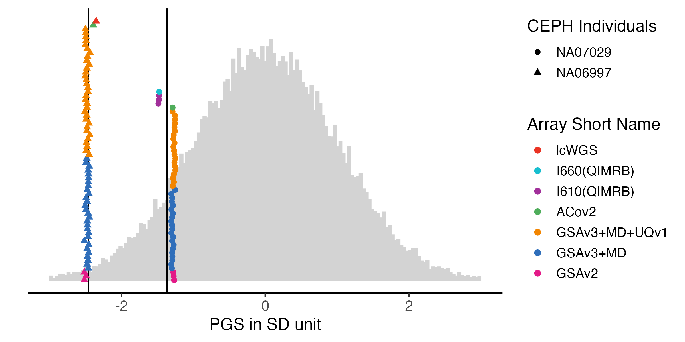
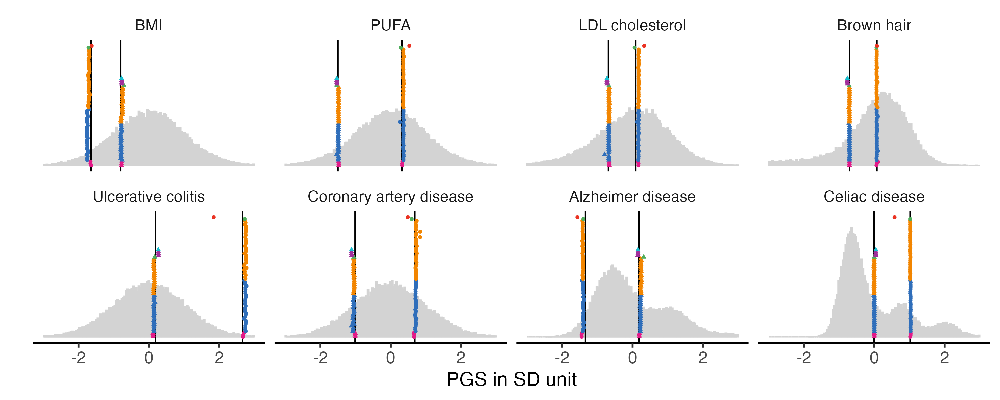
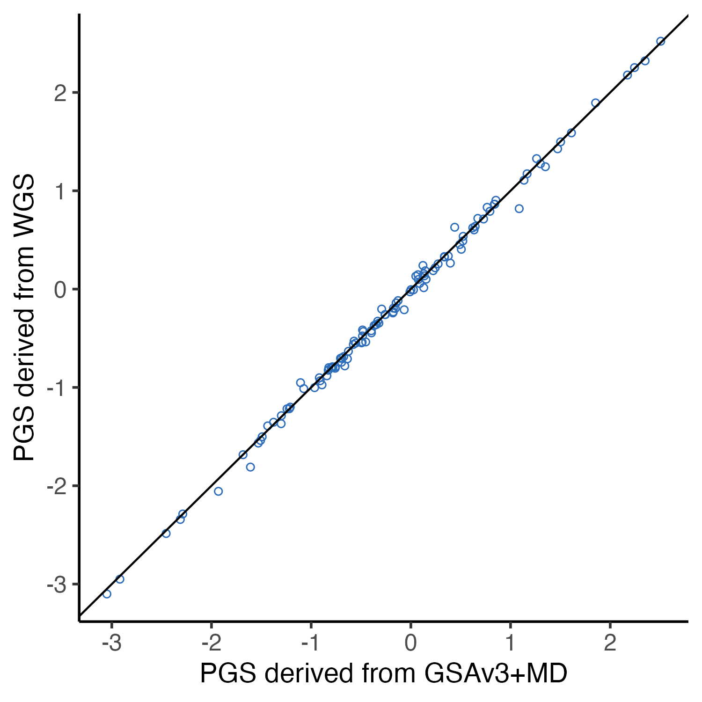
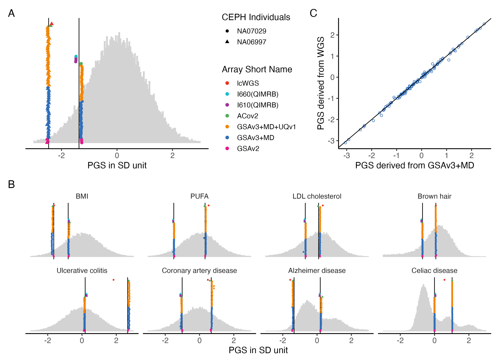
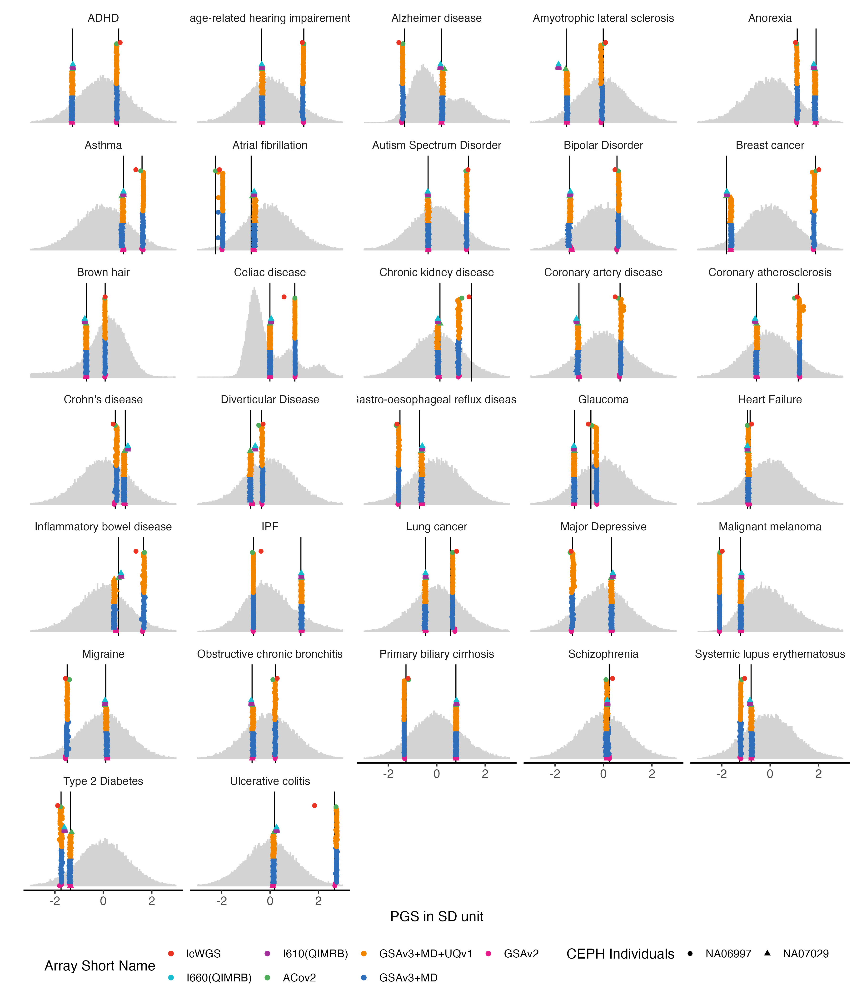
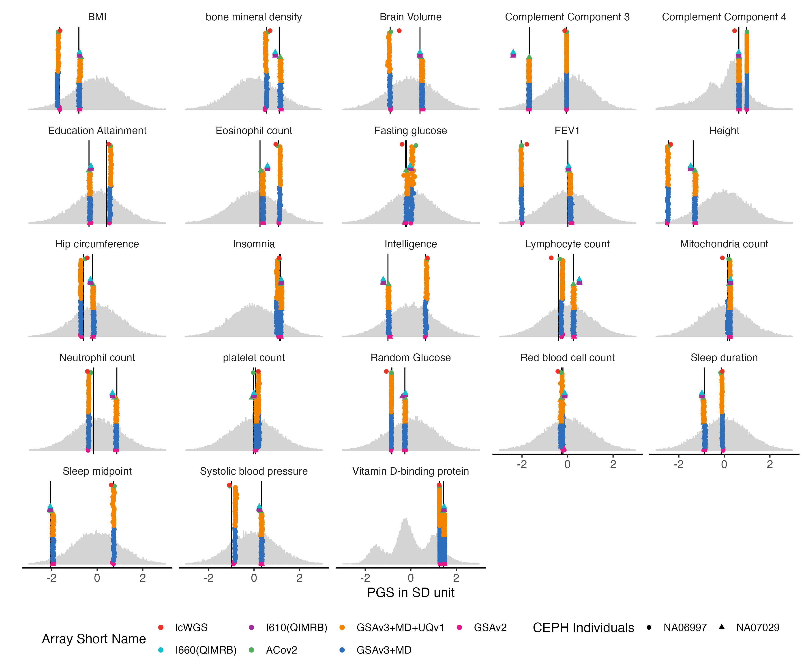
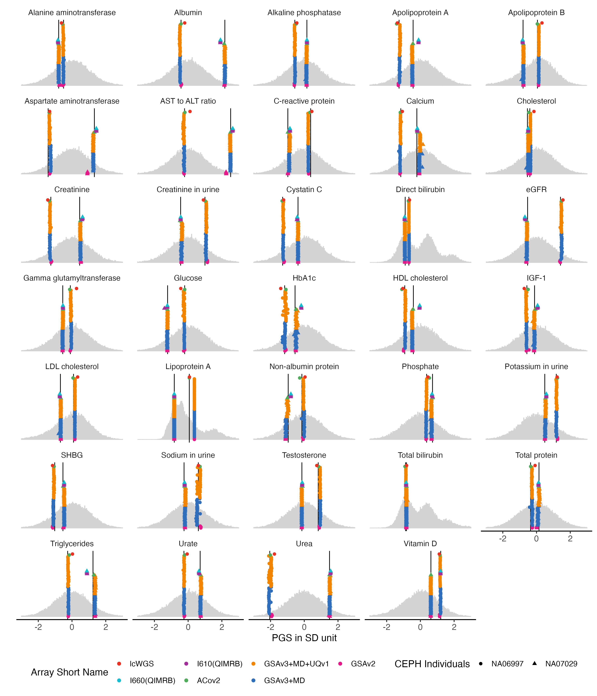
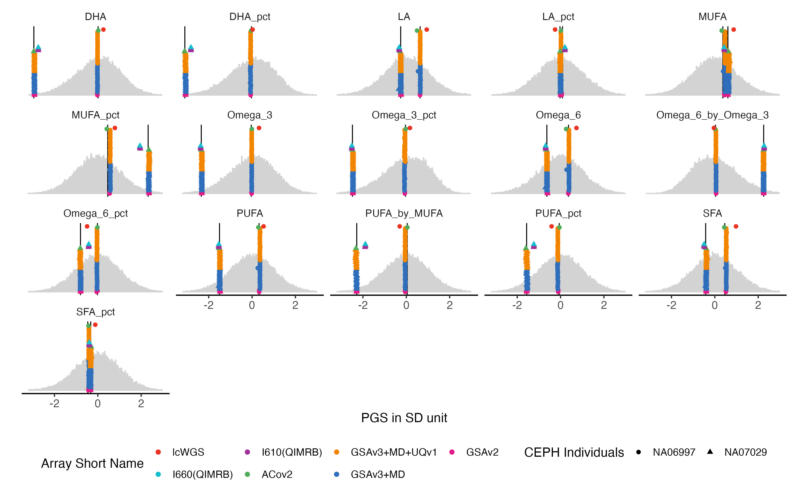
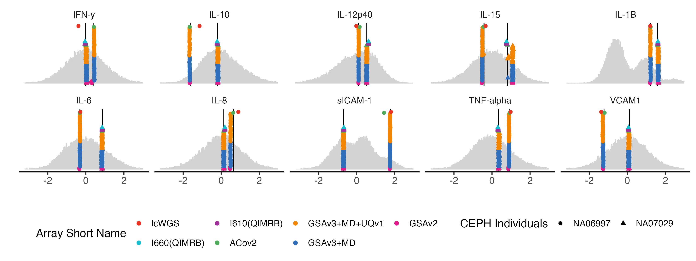

```{r setup, echo=FALSE, message=FALSE, warning=FALSE}
knitr::opts_chunk$set(message = FALSE, warning = FALSE)
# You need these libraries to run this template:

library(rmarkdown)    # install.packages("rmarkdown") 
library(epuRate)      # devtools::install_github("holtzy/epuRate", force=TRUE)
library(ggplot2)
library(DT)
library(plotly)
library(data.table)
library(gridExtra)
library(grid)
library(ggfortify)
library(reshape2)
library(cowplot)
library(ggpubr)
library(kableExtra)
library(openxlsx)
library(plotROC)
library(pROC)
library(dplyr)
library(tibble)
library(tidyr)
library(patchwork)

```


<br>
<br>
<br>


# Data Input
## prepare trait list 

We selected 115 traits to do the analysis. 
Each analysis will take some of them as examples to put in the main figure, and separate the last of them into 5 groups to put in sup figures. 


```{r, eval = F}

predictor.list = read.csv("Tables/SupTable2_Predictors.csv")
included_traits = predictor.list$Predictor

## grouping traits
traits_binary = predictor.list[which(predictor.list$Group == "Binary" ),"Predictor"]
traits_quanti = predictor.list[which(predictor.list$Group == "Quantitative"),"Predictor"]
traits_35bm   = predictor.list[which(predictor.list$Group == "Biomarker"),"Predictor"]
traits_pfa   = predictor.list[which(predictor.list$Group == "Protein and Fatty Acid"),"Predictor"]

```


## input benchmark data

We used the European samples in the batch 1 of Lifelines data. 
The data was imputed using HRC imputation panel in house. 

```{r, eval = F}
prs.bench.norm = read.csv("Data/LL/LifeLines1_Eur_140_traits_GCTB_PRS_self_standardized.csv")

## extract used traits
prs.bench.norm = prs.bench.norm[,colnames(prs.bench.norm)%in%included_traits]
prs.bench.norm$IID = row.names(prs.bench.norm)

## melt it
melted.prs = reshape2::melt(prs.bench.norm,  id.vars = "IID")
melted.prs$value = as.numeric(melted.prs$value)

## add the Label of phenotype
melted.prs$Trait = predictor.list[match(melted.prs$variable, predictor.list$Predictor),"Label"]

```


## input control data

We will use the standardized data for better visualization. 

```{r, eval = F}
control.prs = read.csv("Data/LL_standardized_PGS_of_CEPH_samples.csv", row.names =1)
```

## rename chips

We defined shorter chip name to replace the long names. 

```{r, eval = F}
control.prs = control.prs  %>%
  mutate(Array = recode(Chip,
    "UQVn1_20032937X379897" = "GSAv3+MD+UQv1",
    "GSAMD-24v3-0-EA_20034606" = "GSAv3+MD",
    "Axiom_HGCoV2_1.r3" = "ACov2",
    "GSAMD-24v1-0_20011747" = "GSAv1",
    "GSAMD-24v2-0_20024620" = "GSAv2",
    "Human370v1_C" = "I370",
    "Human610-Quadv1_B" = "I610(QIMRB)",
    "Human660W-Quad_v1_C" = "I660(QIMRB)",
    "LowPass" = "lcWGS"
  ))
```

## selected samples

In this analysis, we will use 3 CEPH control samples, and only use the data imputed with HRC panel.


```{r, eval = F}
## exclude the TopMed imputed data
control.prs = data.frame(control.prs[which(control.prs$imputation_panel != "TopMedr3" ), ])
## exclude none important control samples 
control.prs = control.prs[control.prs$Study_ID%in% c("NA06997", "NA07029", "NA10861"),]
## drop sample levels
control.prs$Study_ID = factor(control.prs$Study_ID , levels = unique(control.prs$Study_ID ))
## save a full copy for different analysis
full.control.prs = control.prs
```
# Prepare data for plot


## Set up WGS verticle lines

```{r, message=FALSE, warning=FALSE, eval = F}
control.prs = full.control.prs
# set the position of the vertical line as WGS data
data.vert = control.prs[which(control.prs$Chip =="WGS"), which(colnames(control.prs)%in%c(included_traits ,"Study_ID" ))]

row.names(data.vert) = data.vert$Study_ID
data.vert = data.vert[,-1]
data.vert = data.frame(t(data.vert))
data.vert = data.vert[row.names(data.vert)%in%included_traits,]
data.vert$variable = row.names(data.vert)
data.vert$Trait = predictor.list[match(data.vert$variable, predictor.list$Predictor),"Label"]

```


## add position for control samples


```{r, eval = F}
## exclude WGS from data
control.prs = control.prs[which(control.prs$Chip != "WGS"),]
control.prs <- control.prs %>%
  group_by(Study_ID) %>%
  mutate(y.position = row_number()-1) %>%
  ungroup()  # Ungroup to return to normal data frame structure
control.prs$y.position = 20*(control.prs$y.position)
control.prs = data.frame(control.prs)
```


## melt the data

```{r, eval = F}
melted.control.prs = reshape2::melt(control.prs, 
                          id.vars =colnames(control.prs)[!colnames(control.prs)%in%included_traits], 
                          measure.vars = colnames(control.prs)[colnames(control.prs)%in%included_traits])
melted.control.prs$value = as.numeric(melted.control.prs$value)
## add the phenotype 
## use phenotype name instead of predictor name 
melted.control.prs$Trait = predictor.list[match(melted.control.prs$variable, predictor.list$Predictor),"Label"]

```


# Figure 2

## Fig2A. Height with only 2 controls in all chips

```{r, fig.width=8, fig.height=3, eval = F}

sample.levels = c("NA07029", "NA06997")
array.levels = c(    
   "GSAv2", "GSAv3+MD", "GSAv3+MD+UQv1", 
   "ACov2", "I610(QIMRB)", "I660(QIMRB)", "lcWGS")
color7 =c("#EA3323", "#17BECF", "#A12F9A", "#4FAD5B", "#F28500", "#2F6EBA", "#E31A88")

ht.melted.prs = melted.prs[which(melted.prs$variable =="Height_03"  ),]
ht.data.vert = data.vert[which(data.vert$variable == "Height_03"),]
ht.melted.control.prs = melted.control.prs[which(melted.control.prs$variable == "Height_03" & melted.control.prs$Study_ID %in% sample.levels ),]
ht.melted.control.prs$Study_ID = factor(ht.melted.control.prs$Study_ID , levels = sample.levels)
ht.melted.control.prs$Array <- factor(ht.melted.control.prs$Array, levels = rev(array.levels) )
ht.melted.control.prs$y.position = ht.melted.control.prs$y.position/2

```


```{r, fig.width=8, fig.height=4, eval = F}

ht.g.hist = ggplot() + 
  geom_histogram(data =ht.melted.prs , aes(x = value ), bins = 150, fill = "light grey", color = "light grey") + 
  geom_vline(data = ht.data.vert, mapping = aes(xintercept = NA06997), color = "black") +
  geom_vline(data = ht.data.vert, mapping = aes(xintercept = NA07029), color = "black") +
  geom_point(data = ht.melted.control.prs, aes(x = value, y =y.position, color = Array, shape = Study_ID), size = 2) + 
  xlim(-3,3) +
    theme_classic(base_size = 14) +
theme(
   panel.grid.major = element_blank(), # Remove major grid lines
    panel.grid.minor = element_blank(), # Remove minor grid lines
    plot.title = element_text(hjust = 0.5),
    axis.title = element_text(),
    axis.text = element_text(size = 12),
    legend.position = "right" 
  ) +
  scale_color_manual(
    name = "Array Short Name",
    values = color7) + 
  scale_shape_manual(name = "CEPH Individuals", values = c(16,17) ) +  ## rename Study_ID as CEPH Individual
  scale_y_continuous(labels = NULL, breaks = NULL) + # Remove both labels and ticks
  xlab("PGS in SD unit") + ylab("")  

ht.g.hist

#ggsave(ht.g.hist,  filename = "Figures/Fig2.A.PGS_benchmarking_height_with_LL.png", width = 8, height = 3)
#ggsave(ht.g.hist,  filename = "Figures/Fig2.A.PGS_benchmarking_height_with_LL.pdf", width =8, height = 4)

```




## Fig2B. Consistency plot with 8 traits. 

We chose eight traits to display in main figure. 

First row:
BMI, PUFA (remove met-d) LDL cholesterol, brown hair

Second row
Ulcerative colitis, coronary artery disease, Alzheimer, Celiac


```{r, fig.width=8, fig.height=3, eval = F}
## define list
example.traits = c(  "BMI_02", "UKB_FA_2022_met.d.PUFA", "UKB_35BM_2021_LDL_direct_adjstatins", "HairColor_01", 
                     "UC_01", "CAD_01", "Alzheimer_02", "CeliacDisease_01")

## select traits in data and  simplify to only HRC imputed for control samples
example.melted.prs = melted.prs[which(melted.prs$variable %in% example.traits ),]
example.data.vert = data.vert[which(data.vert$variable %in% example.traits ),]
example.melted.control.prs = melted.control.prs[which(melted.control.prs$variable %in% example.traits &
                                      melted.control.prs$Array %in% array.levels &
                                      melted.control.prs$Study_ID %in% sample.levels  ),]

# set trait order
order.matching.table = unique(example.melted.control.prs [,c("variable", "Trait")])
trait.order.for.plot = order.matching.table[match(example.traits, order.matching.table$variable), "Trait"]
example.melted.prs$Trait = factor(example.melted.prs$Trait, levels = trait.order.for.plot)
example.data.vert$Trait = factor(example.data.vert$Trait, levels =trait.order.for.plot)
example.melted.control.prs$Trait = factor(example.melted.control.prs$Trait, levels = trait.order.for.plot)

## set array order
example.melted.control.prs$Array <- factor(example.melted.control.prs$Array, levels = rev(array.levels) )

```


```{r, fig.width=8, fig.height=3, eval = F}

example.g.hist = ggplot() + 
  geom_histogram(data =example.melted.prs , aes(x = value ), bins = 150, fill = "light grey", color = "light grey") + 
  facet_wrap(~Trait,  nrow =2, ncol= 4, ) + 
  geom_vline(data = example.data.vert, mapping = aes(xintercept = NA06997), color = "black") +
  geom_vline(data = example.data.vert, mapping = aes(xintercept = NA07029), color = "black") +
  geom_point(data = example.melted.control.prs, aes(x = value, y =y.position, color = Array, shape = Study_ID), size = 1) + 
  xlab("PGS in SD unit") +
  ylab("") + xlim(-3,3) +
    theme_classic(base_size = 14) +
theme(
   panel.grid.major = element_blank(), # Remove major grid lines
    panel.grid.minor = element_blank(), # Remove minor grid lines
    plot.title = element_text(hjust = 0.5),
    axis.title = element_text(),
    axis.text = element_text(size = 12),
    legend.position = "none" ,
   strip.background = element_blank()
  )+
  scale_color_manual(
    values = c( color7)) + 
  scale_y_continuous(labels = NULL, breaks = NULL)  # Remove both labels and ticks

example.g.hist
#ggsave(example.g.hist, filename = "Figures/Fig2.B.PGS_benchmarking_Fig2B_8_traits.png", width = 10, height = 4)
```



## Fig2C. slop figure


```{r, eval = F}
## slop figure example
example.test.data = data.frame(
   WGS = as.vector(as.matrix(
     full.control.prs[which(
     full.control.prs$Study_ID =="NA07029" & 
     full.control.prs$Chip =="WGS"),]
     )),
  GSA = as.vector(as.matrix(
    full.control.prs[which(full.control.prs$Study_ID =="NA07029" & 
  full.control.prs$Batch =="GRP_B11_GSResults_20220225_MD" ),]
  )),
  Predictor = colnames(full.control.prs)
  )

example.test.data$GSA = as.numeric( example.test.data$GSA)
example.test.data$WGS = as.numeric( example.test.data$WGS)
example.test.data = example.test.data[example.test.data$Predictor %in% predictor.list$Predictor,]
example.test.data$Trait = predictor.list[match(example.test.data$Predictor, predictor.list$Predictor),"Label"]

example.plot.gsa.vs.wgs = ggplot(data = example.test.data, aes(x = GSA, y = WGS)) + 
  geom_point(shape = 21, color =  "#2F6EBA") + 
  geom_abline() +    
  theme_classic(base_size = 14) +
theme(
   panel.grid.major = element_blank(), # Remove major grid lines
    panel.grid.minor = element_blank(), # Remove minor grid lines
    plot.title = element_text(hjust = 0.5),
    axis.title = element_text(),
    axis.text = element_text(size = 12)
  ) +
  labs( #title = "PGS of 129 traits from \n 1 example genotyping event", 
       x = "PGS derived from GSAv3+MD", 
       y = "PGS derived from WGS")
example.plot.gsa.vs.wgs
#ggsave(example.plot.gsa.vs.wgs, file = "Figures/Fig2.C.example.plot.gsa.vs.wgs.png", width = 3, height = 3)

```



## output Fig2 combined

```{r, fig.width=11, fig.height=8, eval = F}
# Add manual tags to each plot
pA <- ht.g.hist + labs(tag = "A")
pC <- example.plot.gsa.vs.wgs + labs(tag = "C")
pB <- example.g.hist + labs(tag = "B")

# Layout with top row and bottom row
top_row <- pA + pC + plot_layout(widths = c(6, 5))
final_plot <- top_row / pB + plot_layout(heights = c(4, 4))

# Display
final_plot
ggsave(plot = final_plot, filename = "Figures/Fig2_combined_benchmarked_with_LL1.jpeg", width = 11, height = 8)
```



# Sup Figure 1

Same plot are made for all the 115 traits, and grouped in five groups.

## Binary traits

```{r,  fig.width=12, fig.height= 12, warning=F, message=F, eval = F}
nbm.list = traits_binary
nbm.melted.prs = melted.prs[which(melted.prs$variable %in%nbm.list ),]
nbm.data.vert = data.vert[which(data.vert$variable  %in%nbm.list ),]
nbm.melted.control.prs = melted.control.prs[which(melted.control.prs$variable %in%nbm.list & melted.control.prs$Study_ID %in% sample.levels),]
nbm.melted.control.prs$y.position = nbm.melted.control.prs$y.position/2
nbm.melted.control.prs$Array = factor(nbm.melted.control.prs$Array, levels = rev(array.levels))

g.hist = ggplot() + 
  geom_histogram(data =nbm.melted.prs , aes(x = value ), bins = 250, fill = "light grey", color = "light grey") + 
  facet_wrap(~Trait,  ncol= 5) + 
  geom_vline(data = nbm.data.vert, mapping = aes(xintercept = NA06997), color = "black") +
  geom_vline(data = nbm.data.vert, mapping = aes(xintercept = NA07029), color = "black") +
  geom_point(data = nbm.melted.control.prs, aes(x = value, y =y.position, color = Array, shape = Study_ID), size = 2) + 
  xlim(-3,3) +
    theme_classic(base_size = 14) +
theme(
   panel.grid.major = element_blank(), # Remove major grid lines
    panel.grid.minor = element_blank(), # Remove minor grid lines
    plot.title = element_text(hjust = 0.5),
    axis.title = element_text(),
    axis.text = element_text(size = 12),
    legend.position = "bottom", ##c(0.8,0.05) ,
      strip.background = element_blank()
  ) +
  scale_color_manual(
    name = "Array Short Name",
    values = color7) + 
  scale_shape_manual(name = "CEPH Individuals", values = c(16,17) ) +
  scale_y_continuous(labels = NULL, breaks = NULL) + # Remove both labels and ticks
  xlab("PGS in SD unit") + ylab("")  
# ggsave(g.hist,   filename = ("Figures/SupFig1A.PGS_benchmarking_binary_traits.jpeg"), width = 12, height = 14)
g.hist
```

  



## Quantitative traits

```{r,  fig.width=12, fig.height= 10, warning=F, message=F, eval = F}

nbm.list = traits_quanti
nbm.melted.prs = melted.prs[which(melted.prs$variable %in%nbm.list ),]
nbm.data.vert = data.vert[which(data.vert$variable  %in%nbm.list ),]
nbm.melted.control.prs = melted.control.prs[which(melted.control.prs$variable %in%nbm.list & melted.control.prs$Study_ID %in% sample.levels),]
nbm.melted.control.prs$y.position = nbm.melted.control.prs$y.position/2
nbm.melted.control.prs$Array = factor(nbm.melted.control.prs$Array, levels = rev(array.levels))

g.hist = ggplot() + 
  geom_histogram(data =nbm.melted.prs , aes(x = value ), bins = 350, fill = "light grey", color = "light grey") + 
  facet_wrap(~Trait,  ncol= 5) + 
  geom_vline(data = nbm.data.vert, mapping = aes(xintercept = NA06997), color = "black") +
  geom_vline(data = nbm.data.vert, mapping = aes(xintercept = NA07029), color = "black") +
  geom_point(data = nbm.melted.control.prs, aes(x = value, y =y.position, color = Array, shape = Study_ID), size = 2) + 
  xlim(-3,3) +
    theme_classic(base_size = 14) +
theme(
   panel.grid.major = element_blank(), # Remove major grid lines
    panel.grid.minor = element_blank(), # Remove minor grid lines
    plot.title = element_text(hjust = 0.5),
    axis.title = element_text(),
    axis.text = element_text(size = 12),
    legend.position = "bottom", ##c(0.8,0.05) ,
      strip.background = element_blank()
  ) +
  scale_color_manual(
    name = "Array Short Name",
    values = color7) + 
  scale_shape_manual(name = "CEPH Individuals", values = c(16,17) ) +
  scale_y_continuous(labels = NULL, breaks = NULL) + # Remove both labels and ticks
  xlab("PGS in SD unit") + ylab("")  
#ggsave(g.hist,   filename = ("Figures/SupFig1B.PGS_benchmarking_quantitative_traits.jpeg"), width = 12, height = 10)
g.hist
```



## UKB Biomarkers

```{r,  fig.width=12, fig.height= 14, warning=F, message=F, eval = F}

bm.list = traits_35bm
bm.melted.prs = melted.prs[which(melted.prs$variable %in%bm.list ),]
bm.data.vert = data.vert[which(data.vert$variable  %in%bm.list ),]
bm.melted.control.prs = melted.control.prs[which(melted.control.prs$variable %in%bm.list & melted.control.prs$Study_ID %in% sample.levels),]
bm.melted.control.prs$y.position = bm.melted.control.prs$y.position/2
bm.melted.control.prs$Array = factor(bm.melted.control.prs$Array, levels = rev(array.levels))
g.hist = ggplot() + 
  geom_histogram(data =bm.melted.prs , aes(x = value ), bins = 350, fill = "light grey", color = "light grey") + 
  facet_wrap(~Trait,  ncol= 5) + 
  geom_vline(data = bm.data.vert, mapping = aes(xintercept = NA06997), color = "black") +
  geom_vline(data = bm.data.vert, mapping = aes(xintercept = NA07029), color = "black") +
  geom_point(data = bm.melted.control.prs, aes(x = value, y =y.position, color = Array, shape = Study_ID), size = 2) + 
  xlim(-3,3) +
    theme_classic(base_size = 14) +
theme(
   panel.grid.major = element_blank(), # Remove major grid lines
    panel.grid.minor = element_blank(), # Remove minor grid lines
    plot.title = element_text(hjust = 0.5),
    axis.title = element_text(),
    axis.text = element_text(size = 12),
    legend.position = "bottom", ##c(0.8,0.05) ,
      strip.background = element_blank()
  ) +
  scale_color_manual(
    name = "Array Short Name",
    values = color7) + 
  scale_shape_manual(name = "CEPH Individuals", values = c(16,17) ) +
  scale_y_continuous(labels = NULL, breaks = NULL) + # Remove both labels and ticks
  xlab("PGS in SD unit") + ylab("")  
#ggsave(g.hist,   filename = paste0("Figures/SupFig1C.PGS_benchmarking_35BM_traits.jpeg"), width = 12, height = 14)
g.hist
```





## Fatty Acids 

```{r,  fig.width=12, fig.height= 6, warning=F, message=F, eval = F}
bm.list = traits_pfa[grep("UKB_FA_2022", traits_pfa)]
bm.melted.prs = melted.prs[which(melted.prs$variable %in%bm.list ),]
bm.data.vert = data.vert[which(data.vert$variable  %in%bm.list ),]
bm.melted.control.prs = melted.control.prs[which(melted.control.prs$variable %in%bm.list & melted.control.prs$Study_ID %in% sample.levels),]
bm.melted.control.prs$y.position = bm.melted.control.prs$y.position/2
bm.melted.control.prs$Array = factor(bm.melted.control.prs$Array, levels = rev(array.levels))
g.hist = ggplot() + 
  geom_histogram(data =bm.melted.prs , aes(x = value ), bins = 250, fill = "light grey", color = "light grey") + 
  facet_wrap(~Trait,  ncol= 5) + 
  geom_vline(data = bm.data.vert, mapping = aes(xintercept = NA06997), color = "black") +
  geom_vline(data = bm.data.vert, mapping = aes(xintercept = NA07029), color = "black") +
  geom_point(data = bm.melted.control.prs, aes(x = value, y =y.position, color = Array, shape = Study_ID), size = 2) + 
  xlim(-3.2,3) +
    theme_classic(base_size = 14) +
theme(
   panel.grid.major = element_blank(), # Remove major grid lines
    panel.grid.minor = element_blank(), # Remove minor grid lines
    plot.title = element_text(hjust = 0.5),
    axis.title = element_text(),
    axis.text = element_text(size = 12),
    legend.position = "bottom", ##c(0.8,0.05) ,
      strip.background = element_blank()
  ) +
  scale_color_manual(
    name = "Array Short Name",
    values = color7) + 
  scale_shape_manual(name = "CEPH Individuals", values = c(16,17) ) +
  scale_y_continuous(labels = NULL, breaks = NULL) + # Remove both labels and ticks
  xlab("PGS in SD unit") + ylab("")  
#ggsave(g.hist,   filename = ("Figures/SupFig1D.PGS_benchmarking_FF_traits.jpeg"), width = 12, height = 7.5)
g.hist

```



## proteomics traits


```{r,  fig.width=12, fig.height= 4, warning=F, message=F, eval = F}

bm.list = traits_pfa[grep("UKB_PPP", traits_pfa)]
bm.melted.prs = melted.prs[which(melted.prs$variable %in%bm.list ),]
bm.data.vert = data.vert[which(data.vert$variable  %in%bm.list ),]
bm.melted.control.prs = melted.control.prs[which(melted.control.prs$variable %in%bm.list & melted.control.prs$Study_ID %in% sample.levels),]
bm.melted.control.prs$y.position = bm.melted.control.prs$y.position/2
bm.melted.control.prs$Array = factor(bm.melted.control.prs$Array, levels = rev(array.levels))
g.hist = ggplot() + 
  geom_histogram(data =bm.melted.prs , aes(x = value ), bins = 250, fill = "light grey", color = "light grey") + 
  facet_wrap(~Trait,  ncol= 5) + 
  geom_vline(data = bm.data.vert, mapping = aes(xintercept = NA06997), color = "black") +
  geom_vline(data = bm.data.vert, mapping = aes(xintercept = NA07029), color = "black") +
  geom_point(data = bm.melted.control.prs, aes(x = value, y =y.position, color = Array, shape = Study_ID), size = 2) + 
  xlim(-3.2,3) +
    theme_classic(base_size = 14) +
theme(
   panel.grid.major = element_blank(), # Remove major grid lines
    panel.grid.minor = element_blank(), # Remove minor grid lines
    plot.title = element_text(hjust = 0.5),
    axis.title = element_text(),
    axis.text = element_text(size = 12),
    legend.position = "bottom", ##c(0.8,0.05) ,
      strip.background = element_blank()
  ) +
  scale_color_manual(
    name = "Array Short Name",
    values = color7) + 
  scale_shape_manual(name = "CEPH Individuals", values = c(16,17) ) +
  scale_y_continuous(labels = NULL, breaks = NULL) + # Remove both labels and ticks
  xlab("") + ylab("")  
#ggsave(g.hist,   filename = ("Figures/SupFig1E.PGS_benchmarking_pp_traits.jpeg"), width = 12, height = 4.5)
g.hist
```



# slop of comparing to WGS

## calculate slop for each event

```{r, eval = F}
control.prs = full.control.prs
control.prs$Slope = NA
control.prs$Rsquare = NA
square <- function(x){return(x^2)}

for (i in 1:nrow(control.prs)){
test.data = data.frame(x=as.vector(as.matrix(( control.prs[i, (colnames(control.prs)%in%included_traits) ]))),
                       WGS = as.vector(as.matrix(( control.prs[which(control.prs$Chip == "WGS" &
                          control.prs$Study_ID == control.prs[i,"Study_ID"]  ), (colnames(control.prs)%in%included_traits) ]))))
control.prs[i,"Slope"]  = coef(lm(formula = WGS ~ x, data = test.data))[2]
control.prs[i,"Rsquare"]  = square(cor(test.data$WGS, test.data$x))
}
```

## summarize on sample and chip level

```{r, eval = F}
slope.summary = control.prs %>% 
  filter(Chip != "WGS") %>%   
  group_by(Study_ID, Chip) %>% 
  summarize(
        count = n(),
    mean_slope = mean(Slope, na.rm = TRUE) ,
    sd_slope = sd(Slope, na.rm = TRUE) ,
    min_slope = min(Slope, na.rm = TRUE),
    max_slope = max(Slope, na.rm = TRUE),
    mean_Rsquare = mean(Rsquare, na.rm = TRUE) ,
    sd_Rsquare = sd(Rsquare, na.rm = TRUE) ,
    min_Rsquare = min(Rsquare, na.rm = TRUE),
    max_Rsquare = max(Rsquare, na.rm = TRUE)
) %>% arrange(Study_ID, -count, Chip)
write.csv(slope.summary, paste("Tables/original_table_for_summarizing_slope_and_Rsquare.csv") )
slope.summary
```

```{r, echo = F}
slope.summary = read.csv("Tables/original_table_for_summarizing_slope_and_Rsquare.csv", row.names = 1)
slope.summary
```

## summarize on sample level

```{r, eval = F}
slope.summary2 = control.prs %>% 
  filter(Chip != "WGS") %>%   
  group_by(Study_ID) %>% 
  summarize(
        count = n(),
    mean_slope = round(mean(Slope, na.rm = TRUE), 4) ,
    sd_slope = round(sd(Slope, na.rm = TRUE), 4) ,
    min_slope = round(min(Slope, na.rm = TRUE),4),
    max_slope = round(max(Slope, na.rm = TRUE),4),
    mean_Rsquare = round(mean(Rsquare, na.rm = TRUE), 4) ,
    sd_Rsquare = round(sd(Rsquare, na.rm = TRUE), 4) ,
    min_Rsquare = round(min(Rsquare, na.rm = TRUE),4),
    max_Rsquare = round(max(Rsquare, na.rm = TRUE),4))
slope.summary2
```


```{r, echo = F}
slope.summary2 = read.csv("Tables/original_table_for_summarizing_slope_and_Rsquare_per_sample.csv", row.names = 1)
slope.summary2
```

## summarize on sample and platform level

```{r, eval = F}
slope.summary3 = control.prs %>% 
  filter(Chip != "WGS") %>%   
  group_by(Study_ID, Platform) %>% 
  summarize(
        count = n(),
    mean_slope = round(mean(Slope, na.rm = TRUE), 4) ,
    sd_slope = round(sd(Slope, na.rm = TRUE), 4) ,
    min_slope = round(min(Slope, na.rm = TRUE),4),
    max_slope = round(max(Slope, na.rm = TRUE),4),
    mean_Rsquare = round(mean(Rsquare, na.rm = TRUE), 4) ,
    sd_Rsquare = round(sd(Rsquare, na.rm = TRUE), 4) ,
    min_Rsquare = round(min(Rsquare, na.rm = TRUE),4),
    max_Rsquare = round(max(Rsquare, na.rm = TRUE),4))
slope.summary3
```


```{r, echo = F}
slope.summary3 = read.csv("Tables/original_table_for_summarizing_slope_and_Rsquare_per_sample_lab.csv", row.names = 1)
slope.summary3
```

## summarize on sample, platform and chip level

```{r, eval = F}
slope.summary4 = control.prs %>% 
  filter(Chip != "WGS") %>%   
  group_by(Study_ID, Platform, Chip) %>% 
  summarize(
        count = n(),
    mean_slope = round(mean(Slope, na.rm = TRUE), 4) ,
    sd_slope = round(sd(Slope, na.rm = TRUE), 4) ,
    min_slope = round(min(Slope, na.rm = TRUE),4),
    max_slope = round(max(Slope, na.rm = TRUE),4),
    mean_Rsquare = round(mean(Rsquare, na.rm = TRUE), 4) ,
    sd_Rsquare = round(sd(Rsquare, na.rm = TRUE), 4) ,
    min_Rsquare = round(min(Rsquare, na.rm = TRUE),4),
    max_Rsquare = round(max(Rsquare, na.rm = TRUE),4)) %>% 
  arrange(Study_ID, Chip,Platform)

slope.summary4
```


```{r, echo = F}
slope.summary4 = read.csv("Tables/original_table_for_summarizing_slope_and_Rsquare_per_sample_lab_chip.csv", row.names = 1)
slope.summary4
```


