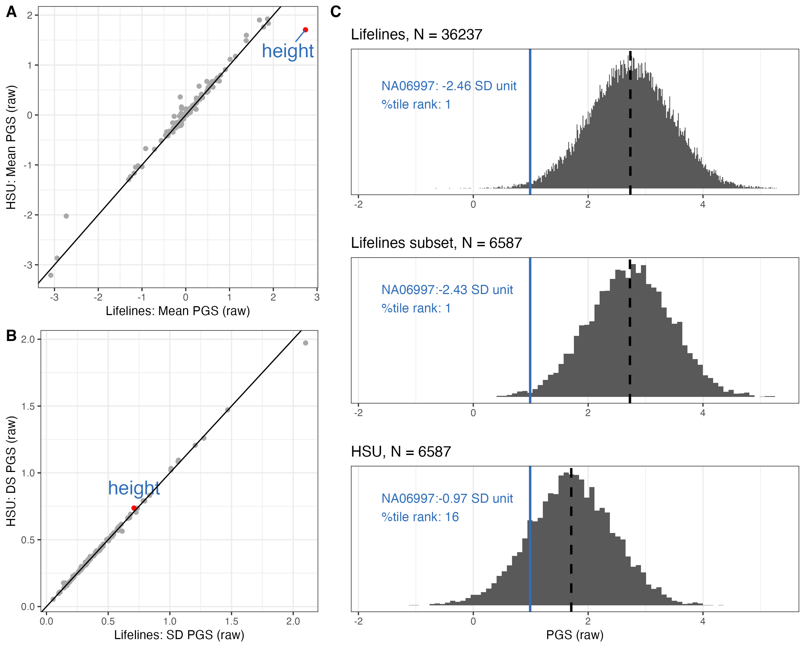

```{r setup, echo=FALSE, message=FALSE, warning=FALSE}
knitr::opts_chunk$set(message = FALSE, warning = FALSE)
# You need these libraries to run this template:

library(rmarkdown)    # install.packages("rmarkdown") 
library(epuRate)      # devtools::install_github("holtzy/epuRate", force=TRUE)
library(ggplot2)
library(DT)
library(plotly)
library(data.table)
library(gridExtra)
library(grid)
library(ggfortify)
library(reshape2)
library(cowplot)
library(ggpubr)
library(kableExtra)
library(openxlsx)
library(plotROC)
library(pROC)
library(dplyr)
library(tibble)
library(tidyr)
library(stringr)
library(ggrepel)

```

We used two different population representative data sets to benchmark the PGS in this study. We calculated the mean and sd of PGSs of each trait, and used them to standardize the benchmarking data itself, and the PGS of CEPH control samples. The distribution of standardized PGS of benchmarking data are used as background when we display the consistency of PGS of CEPH control samples, such in Figure 2 and 3. We also demonstrated how the benchmarking data affect the interpretation of a PGS.  


# Data  

We used two different data sets as the benchmark in this study. 

## Lifelines

We calculated the mean and sd from the raw PGS, standardized the data itself, saved them for standardizing other data. 

```{r,eval = F, warning=F, message=F}

## input bm data
bm.prs.ugli1 = read.csv("Data/LL/UGLI1_all_141_traits_GCTB_PRS.csv",row.names =1)

## select European only
bm.eur = read.table("Data/LL/UGLI0-3_Europeans_n111570_ID_JS.txt", header = T)
bm.prs = bm.prs.ugli1[(bm.prs.ugli1$V2) %in% bm.eur$IID,] 
bm.prs = bm.prs[,-c(1:3)]

## calculate standardization factor
cross.mean = apply(bm.prs, 2,  mean)
cross.sd =   apply(bm.prs, 2,  sd)

mean.sd.table = data.frame(
  trait=colnames(bm.prs),
  mean = cross.mean,
  sd = cross.sd)
write.csv(mean.sd.table, "Data/LifeLines_MEAN_and_SD_of_traits_for_standardization.csv")

## standardize the data itself
stdz.bm.prs = data.frame( sweep(  data.frame(sweep (  sapply (bm.prs,  as.numeric  ), 2, cross.mean)),  2, cross.sd, FUN = '/'))
row.names(stdz.bm.prs) = row.names(bm.prs)
write.csv(stdz.bm.prs, "Data/LL/LifeLines1_Eur_140_traits_GCTB_PRS_self_standardized.csv")

```


## HSU collected samples

PGS of all batches have been organized in Q3046/Results/GRP_master_raw_PRS.csv. Thanks to Laura. 

```{r, eval = F}
prs = read.csv("Data/GRP/GRP_all_GCTB_PRS.csv")
colnames(prs)[1:3] = c("Study_ID", "Batch", "PipelineVersion")

## we will exclude the control samples when we calculate SD and mean.
prs.bench = prs[grep("GM", prs$Study_ID, invert = T), ] 
prs.bench = prs.bench[ grep( "NA" ,  prs.bench$Study_ID , invert = T), ]

## we excluded all the technical control samples 
prs.bench= prs.bench[grep("[A-Za-z]", prs.bench$Study_ID, invert = T ) , ]

## if a sample is genotyped multi times, we will keep only one.
prs.bench <- prs.bench %>%  group_by(Study_ID) %>%  sample_n(1) %>%  ungroup()
prs.bench = data.frame(prs.bench)

## keep only EUR
grp.eur = read.table("Data/GRP/all_grp_EUR.id")
prs.bench = prs.bench[prs.bench$Study_ID %in% grp.eur$V2,]
write.csv(prs.bench, "Data/GRP/Merged_raw_GCTB_PGS_of_benchmarking_samples_in_GRP.csv", row.names = F)
prs.bench.numeric = sapply(prs.bench[, 8:ncol(prs.bench)], as.numeric)


## calculate standardization factor and save it
cross.mean = apply(prs.bench.numeric, 2,  mean)
cross.sd =   apply(prs.bench.numeric, 2,  sd)
standardization.data = data.frame(
  trait = colnames(prs.bench.numeric),
  mean = cross.mean,
  sd = cross.sd)
write.csv(standardization.data, "Data/GRP_MEAN_and_SD_of_traits_for_standardization.csv" )

## self standardization
prs.bench.norm.number = sweep(sweep (  sapply (prs.bench[, 8:ncol(prs.bench)],  as.numeric  ), 2, cross.mean),  2, cross.sd, FUN = '/')
prs.bench.norm = cbind(prs.bench[,c(1:7 )], prs.bench.norm.number)
write.csv(prs.bench.norm, file = "Data/Merged_Standardized_GCTB_PGS_of_benchmarking_samples_in_GRP.csv", row.names = F)

```


# Trait selection

We will extract the traits selected with heritability and rerun correlation thresholds, and group them to organize the figures. 

```{r, fig.height= 8, fig.width=8}
predictor.list = read.csv("Tables/SupTable2_Predictors.csv")
included_traits = predictor.list$Predictor

## grouping traits
traits_binary = predictor.list[which(predictor.list$Group == "Binary" ),"Predictor"]
traits_quanti = predictor.list[which(predictor.list$Group == "Quantitative"),"Predictor"]
traits_35bm   = predictor.list[which(predictor.list$Group == "Biomarker"),"Predictor"]
traits_pfa   = predictor.list[which(predictor.list$Group == "Protein and Fatty Acid"),"Predictor"]
```


# Compare the two BM data in mean and SD

A few traits showed very different mean PGS.  

```{r, fig.width=6, fig.height=6}

mean.sd.table.ll = read.csv("Data/LifeLines_MEAN_and_SD_of_traits_for_standardization.csv", row.names = 1)
mean.sd.table.ll = mean.sd.table.ll[mean.sd.table.ll$trait %in% included_traits,]
colnames(mean.sd.table.ll)[2:3] = paste0("LL_", colnames(mean.sd.table.ll)[2:3] )
mean.sd.table.hsu = read.csv("Data/GRP_MEAN_and_SD_of_traits_for_standardization.csv", row.names = 1)
mean.sd.table.hsu = mean.sd.table.hsu[mean.sd.table.hsu$trait %in% included_traits ,]
colnames(mean.sd.table.hsu)[2:3] = paste0("GRP_", colnames(mean.sd.table.hsu)[2:3] )
mean.sd.table = merge(mean.sd.table.ll, mean.sd.table.hsu, by = "trait")
mean.sd.table$mean.diff = mean.sd.table$LL_mean - mean.sd.table$GRP_mean
mean.sd.table = mean.sd.table[mean.sd.table$trait %in% included_traits,]

f.mean = ggplot(data = mean.sd.table, aes(x = LL_mean, y = GRP_mean)) + 
  geom_point(color = "darkgrey") + 
  geom_point(data=  subset(mean.sd.table, trait=="Height_03"), aes(x = LL_mean, y = GRP_mean), color = "red") +
  geom_text_repel(data = subset(mean.sd.table, trait=="Height_03"), aes(label  = "height"), color = "#2F6EBA", size = 6, vjust = 2) + 
  geom_abline(intercept = 0, slope = 1) +
  theme_bw() + xlab("Lifelines: Mean PGS (raw)") + ylab("HSU: Mean PGS (raw)")

```

Although the sample size of the two BM data are very different, the sd of their PGS in same trait are very similar. 

```{r, fig.width=6, fig.height=6}
mean.sd.table$sd.diff = mean.sd.table$LL_sd - mean.sd.table$GRP_sd

f.sd = ggplot(data = mean.sd.table, aes(x = LL_sd, y = GRP_sd)) + 
  geom_point(color = "darkgrey") + 
  geom_point(data= subset(mean.sd.table, trait=="Height_03") , aes(x = LL_sd, y = GRP_sd), color = "red") +
  geom_text(data = subset(mean.sd.table, trait=="Height_03") , aes(label  = "height"), color = "#2F6EBA", size = 6, vjust = -1) + 
  geom_abline(intercept = 0, slope = 1) +
  theme_bw() + xlab("Lifelines: SD PGS (raw)") + ylab("HSU: DS PGS (raw)")

```


```{r, fig.width=8, fig.height=4}

ggarrange(f.mean, f.sd, ncol=2)
```


# benchmark CEPH data with LL

## calculate ranking of control samples 

```{r, eval = F}
## input standardized LL data
ll.prs.bench.norm = read.csv("Data/LL/LifeLines1_Eur_140_traits_GCTB_PRS_self_standardized.csv", row.names = 1)
ll.prs.bench.norm = ll.prs.bench.norm[,colnames(ll.prs.bench.norm)%in%included_traits]
# Convert to data.tables
ll.prs.bench.norm <- as.data.table(ll.prs.bench.norm)
# Pre-sort all benchmark traits
bench_sorted <- ll.prs.bench.norm[, lapply(.SD, sort)]

## inpute standardized control data
control.prs1 = read.csv("Data/LL_standardized_PGS_of_CEPH_samples.csv", row.names = 1)
melted.control.prs1 = reshape2::melt(control.prs1, 
                          id.vars =colnames(control.prs1)[1:11], 
                          measure.vars = colnames(control.prs1)[colnames(control.prs1)%in%included_traits])
melted.control.prs1 <- as.data.table(melted.control.prs1)

```

Here we define the ranking as how many percent of benchmarking sample have lower value than the tested control sample. 

```{r, eval = F}
# Create a vectorized ranking function
get_rank <- function(trait, value) {
  vec <- bench_sorted[[trait]]
  return(findInterval(value, vec) / length(vec))
}

# Apply vectorized across rows
melted.control.prs1[, ranking_in_LL := mapply(get_rank, as.character(variable), as.numeric(value))]
# melted.control.prs1[, ranking_in_LL := round(ranking_in_LL, 3)]
```


# benchmark CEPH data with HSU collection 


```{r, eval = F}
## input benchmark data
grp.prs.bench.norm = read.csv("Data/GRP//Merged_Standardized_GCTB_PGS_of_benchmarking_samples_in_GRP.csv")
grp.prs.bench.norm = cbind(grp.prs.bench.norm[,1:8], grp.prs.bench.norm[,colnames(grp.prs.bench.norm)%in%included_traits])
# Convert to data.tables
grp.prs.bench.norm <- as.data.table(grp.prs.bench.norm)
# Pre-sort all benchmark traits
bench_sorted <- grp.prs.bench.norm[, lapply(.SD, sort)]

## input CEPH control data
control.prs2 = read.csv("Data/GRP_standardized_PGS_of_CEPH_samples.csv",row.names = 1)

melted.control.prs2 = reshape2::melt(control.prs2, 
                          id.vars =colnames(control.prs2)[1:11], 
                          measure.vars = colnames(control.prs2)[colnames(control.prs2)%in%included_traits])
# Convert to data.tables
melted.control.prs2 <- as.data.table(melted.control.prs2)
```

The ranking is calculated as how many percent of benchmarking sample have lower value than the tested control sample. 

```{r, eval = F}

# Create a vectorized ranking function
get_rank <- function(trait, value) {
  vec <- bench_sorted[[trait]]
  return(findInterval(value, vec) / length(vec))
}

# Apply vectorized across rows
melted.control.prs2[, ranking_in_GRP := mapply(get_rank, as.character(variable), as.numeric(value))]
# melted.control.prs1[, ranking_in_LL := round(ranking_in_LL, 3)]

```


# benchmark CEPH data with LL subset

The two cohorts used as benchmark samples are very different in sample size. Here we randomly took the same number of samples from Lifeline cohort as many as in HSU sample collection. 


## subset raw LL data and standardize

```{r , eval = F}
## input raw
ll.raw = read.csv("Data/LL/UGLI1_all_141_traits_GCTB_PRS.csv", row.names = 1)
## select Europeans
ll.eur = read.table("Data/LL/UGLI0-3_Europeans_n111570_ID_JS.txt", header = T)
ll.raw = ll.raw[(ll.raw$V2) %in% ll.eur$IID,] 
ll.raw = ll.raw[,-c(1:3)]

## subset
set.seed(555)
sampling.list = sample(1:nrow(ll.raw), nrow(grp.prs.bench.norm))
ll.raw.subset = ll.raw[sampling.list,]

## get mean and sd

cross.mean = apply(ll.raw.subset, 2,  mean)
cross.sd =   apply(ll.raw.subset, 2,  sd)

mean.sd.table.llsubset = data.frame(
   trait = colnames(ll.raw.subset),
   mean = cross.mean,
   sd = cross.sd)

## self standardize
ll.subset.norm= sweep(sweep (sapply (ll.raw.subset, as.numeric), 2, cross.mean),  2, cross.sd, FUN = '/')
ll.subset.norm = as.data.frame(ll.subset.norm)
row.names(ll.subset.norm) = row.names(ll.raw.subset)
```


## input raw control and standardize

```{r, eval = F}
raw.control.prs = read.csv("Data/raw_PGS_of_CEPH_samples.csv")
raw.control.prs.info = raw.control.prs[,1:11]
raw.control.prs.number = raw.control.prs[,match(included_traits, colnames(raw.control.prs))]
mean.sd.table.llsubset = mean.sd.table.llsubset[match(included_traits, mean.sd.table.llsubset$trait),]
std.control.prs.number =  sweep(sweep (  sapply (raw.control.prs.number,  as.numeric  ), 2, mean.sd.table.llsubset$mean),  2, mean.sd.table.llsubset$sd, FUN = '/')

control.prs3 = cbind(raw.control.prs.info,std.control.prs.number)

melted.control.prs3 = reshape2::melt(control.prs3, 
                          id.vars =colnames(control.prs3)[1:11], 
                          measure.vars = colnames(control.prs3)[colnames(control.prs3)%in%included_traits])
```


## calculate ranking of control samples 

Here we define the ranking as how many percent of benchmarking sample have lower value than the tested control sample. 


```{r, eval = F}
# Convert to data.tables
ll.subset.norm <- as.data.table(ll.subset.norm)
melted.control.prs3 <- as.data.table(melted.control.prs3)

# Pre-sort all benchmark traits
bench_sorted <- ll.subset.norm[, lapply(.SD, sort)]

# Create a vectorized ranking function
get_rank <- function(trait, value) {
  vec <- bench_sorted[[trait]]
  return(findInterval(value, vec) / length(vec))
}

# Apply vectorized across rows
melted.control.prs3[, ranking_in_LLsubset := mapply(get_rank, as.character(variable), as.numeric(value))]
# melted.control.prs1[, ranking_in_LL := round(ranking_in_LL, 3)]

```


# summarize the ranking of height

## rank of height PGS

```{r, eval = F}

height_ranking =  melted.control.prs1 %>%   
  filter(variable =="Height_03")  %>%
  filter(Study_ID %in% c("NA06997","NA07029", "NA10861"))
height_ranking_wgs = height_ranking %>% filter(imputation_panel == "None")
height_ranking$wgs_ranking = height_ranking_wgs[match(height_ranking$Study_ID,height_ranking_wgs$Study_ID ), "ranking_in_LL"]
height_ranking$error = abs(height_ranking$wgs_ranking - height_ranking$ranking_in_LL)

ranking.summary = height_ranking %>% 
  filter(imputation_panel !="TopMedr3") %>%
  group_by(Study_ID, Chip) %>% 
  summarize(
        count = n(),
    meanranking_in_LL = round(mean(ranking_in_LL, na.rm = TRUE)*100 ,3),
    sdranking_in_LL   = round(sd(ranking_in_LL, na.rm = TRUE)*100   ,3),
    minranking_in_LL  = round(min(ranking_in_LL, na.rm = TRUE)*100  ,3),
    maxranking_in_LL  = round(max(ranking_in_LL, na.rm = TRUE)*100  ,3),
    mean_ranking_error = round(mean(error)*100  ,2),
    range = maxranking_in_LL - minranking_in_LL
) %>% arrange(Study_ID, -count)

ranking.summary
#write.csv(ranking.summary, "Tables/SupTable4_summary_ranking_height_updated_with_UGLI1.csv")
```

## rank NA06997 height PGS with different benchmarking data

```{r, eval = F}

ll.prs = ll.raw
grp.prs = read.csv("Data/GRP/Merged_raw_GCTB_PGS_of_benchmarking_samples_in_GRP.csv")
ll.raw.subset = data.frame(ll.raw.subset)

raw.NA06997.height = round(raw.control.prs[which(raw.control.prs$Study_ID == "NA06997" & raw.control.prs$Chip =="WGS") , "Height_03"], 2)

ll.NA06997.height = round(control.prs1[which(control.prs1$Study_ID =="NA06997" & control.prs1$Chip =="WGS"),  "Height_03"], 2)
grp.NA06997.height = round(control.prs2[which(control.prs2$Study_ID =="NA06997" & control.prs2$Chip =="WGS"),  "Height_03"], 2)
llsubset.NA06997.height = round(control.prs3[which(control.prs3$Study_ID =="NA06997" & control.prs3$Chip =="WGS"),  "Height_03"], 2)

ll.NA06997.height.rank = round(nrow(ll.prs[which(ll.prs$Height_03 < raw.NA06997.height ),]) / nrow(ll.prs)  *100, 0)
grp.NA06997.height.rank = round(nrow(grp.prs[which(grp.prs$Height_03 < raw.NA06997.height ),]) / nrow(grp.prs)  *100, 0)
llsubset.NA06997.height.rank = round(nrow(ll.raw.subset[which(ll.raw.subset$Height_03 < raw.NA06997.height ),]) / nrow(ll.raw.subset)  *100, 0)

itrait="Height_03"
  
xlim.left = min(c(ll.prs[,itrait],  grp.prs[,itrait]))
xlim.right = max(c(ll.prs[,itrait],  grp.prs[,itrait]))
trait.name = predictor.list[which(predictor.list$Predictor == itrait) ,"Label"]
```

### with Lifelines data

```{r, fig.height=8, fig.width=5, eval = F}

label.in.ll = paste0("NA06997: ", ll.NA06997.height," SD unit\n", "%tile rank: ",ll.NA06997.height.rank )

plot.ll = ggplot(data = ll.prs, aes(!!sym(itrait))) +
  geom_histogram(bins = 480) + 
  xlim(xlim.left,xlim.right) +  
  geom_vline(aes(xintercept = mean(ll.prs[,itrait])), color = "black", linetype = "dashed", size = 1) +
  geom_vline(aes(xintercept = raw.NA06997.height), color = "#2F6EBA",  size = 1) +
  theme_bw() +  ylab("") + xlab("")+  
  scale_y_continuous(labels = NULL, breaks = NULL) + 
  ggtitle("Lifelines, N = 36237") +
  annotate("text", x = -1.6, y =230, label = label.in.ll, size =4, hjust = 0, color = "#2F6EBA")
```

## with Lifelines subset data

```{r, fig.height=8, fig.width=5, eval = F}
label.in.llsubset = paste0("NA06997:", llsubset.NA06997.height," SD unit\n", "%tile rank: ", llsubset.NA06997.height.rank )

plot.llsubset = ggplot(data = ll.raw.subset, aes(!!sym(itrait))) +
  geom_histogram(bins = 80) +  
  xlim(xlim.left,xlim.right) +  
  geom_vline(aes(xintercept = mean(ll.raw.subset[,itrait])), color = "black", linetype = "dashed", size = 1) +
  geom_vline(aes(xintercept = raw.NA06997.height), color = "#2F6EBA",  size = 1) +
  theme_bw() +  ylab("") + xlab("")  +
  scale_y_continuous(labels = NULL, breaks = NULL) + 
  ggtitle("Lifelines subset, N = 6587")+
  annotate("text", x = -1.6, y =250, label = label.in.llsubset, size =4, hjust = 0, color = "#2F6EBA")
```

## with HSU collected data

```{r, fig.height=8, fig.width=5, eval = F}
label.in.hsu = paste0("NA06997:", grp.NA06997.height," SD unit\n", "%tile rank: ", grp.NA06997.height.rank )

plot.hsu = ggplot(data = grp.prs, aes(!!sym(itrait))) +
  geom_histogram(bins = 80) +   
  xlim(xlim.left,xlim.right) +  
  geom_vline(aes(xintercept = mean(grp.prs[,itrait])), color = "black", linetype = "dashed", size = 1) +
  geom_vline(aes(xintercept = raw.NA06997.height), color = "#2F6EBA",  size = 1) +
  theme_bw() +  ylab("") + xlab("PGS (raw)")+
scale_y_continuous(labels = NULL, breaks = NULL) + 
  ggtitle(("HSU, N = 6587")) +
  annotate("text", x = -1.6, y =250, label = label.in.hsu, size =4, hjust = 0, color = "#2F6EBA")
```

## combine the plots

```{r, fig.height=8, fig.width=5, eval = F}

height.hist = ggarrange(plot.ll, plot.llsubset, plot.hsu, nrow = 3)+
      theme(plot.margin = margin(t = 20, r = 5, b = 0, l = 5)) 
height.hist
```

# make figure 4


The plots are arranged together into Figure 4. 


```{r, fig.height=8, fig.width=10, eval = F}
library(cowplot)
# Stack f.mean and f.sd vertically, label them A and B
left_col <- plot_grid(
  f.mean, f.sd,
  ncol = 1,
  labels = c("A", "B"),
  label_size = 14,
  label_fontface = "bold"
)

# Combine left column with height.hist labeled C
final_plot <- plot_grid(
  left_col,
  plot_grid(height.hist, labels = "C", label_size = 14, label_fontface = "bold"),
  ncol = 2,
  rel_widths = c(1, 1.5)
)

# Show the full plot
print(final_plot)
ggsave(final_plot, filename = "Figures/Fig4_scoring_with_Lifelines_vs_HSU_for_height_updated_with_UGLI1.jpeg", height = 8, width = 10)

```



